# Admin Authentication System Fix

## Overview

This design addresses the critical authentication errors occurring when accessing the `/admin` route, specifically the "Raw error object when loading user profile: {}" error that prevents proper admin authentication and redirects users to the home page. The solution provides a robust admin authentication system that ensures seamless access for authorized admin users and proper error handling.

## Technology Stack & Dependencies

- **Frontend Framework**: Next.js 15.2.4 with App Router
- **Authentication**: Supabase Auth with @supabase/ssr
- **Database**: PostgreSQL with Supabase
- **State Management**: React Context API
- **TypeScript**: Full type safety implementation
- **UI Components**: Custom components with Tailwind CSS

## Architecture

### Current Authentication Flow Issues

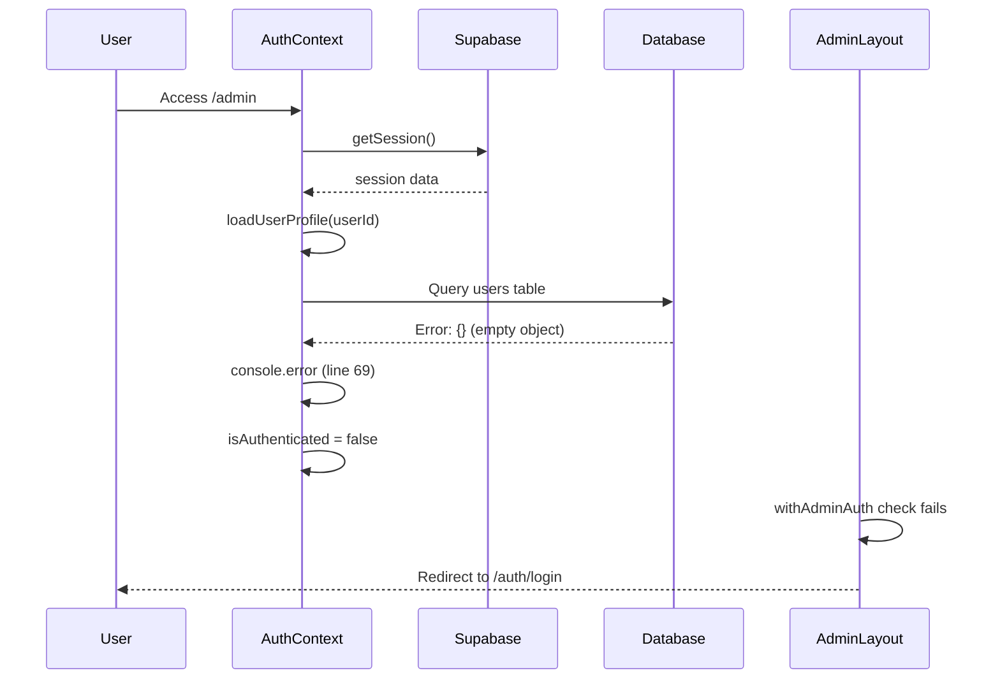

### Fixed Authentication Flow

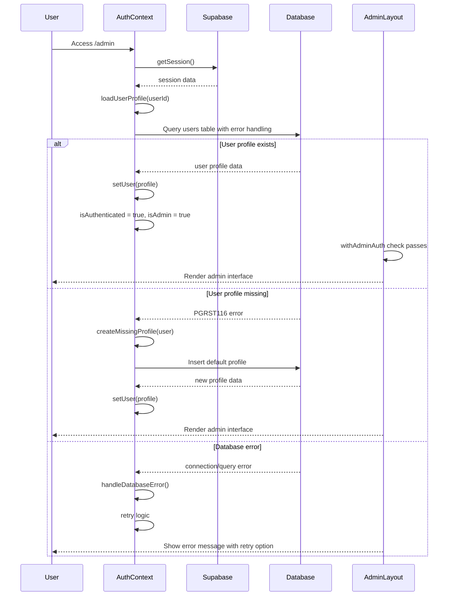

## Component Architecture

### Enhanced Authentication Context

#### Core State Management

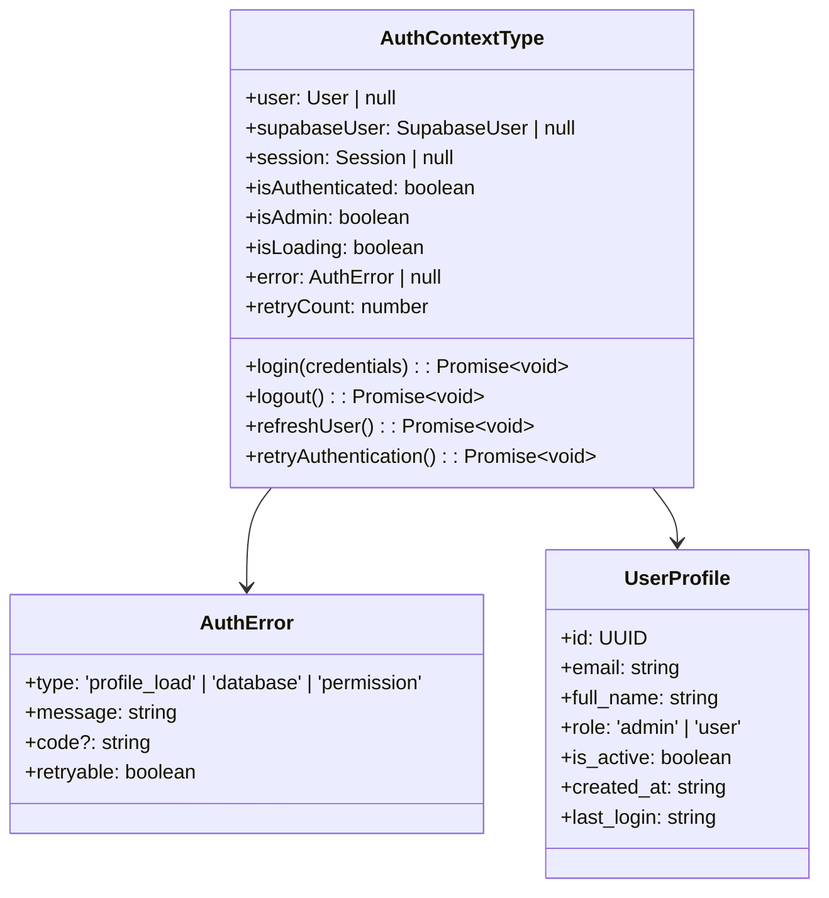

#### Enhanced Profile Loading Logic

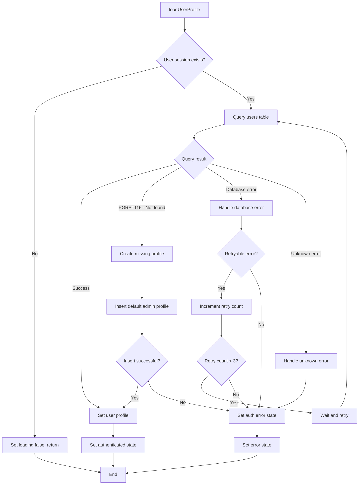

### Admin Route Protection

#### Enhanced withAdminAuth HOC

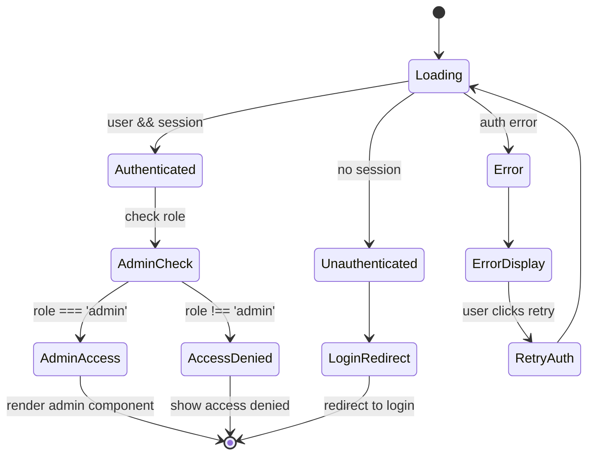

## Data Models & Database Integration

### User Profile Schema Validation

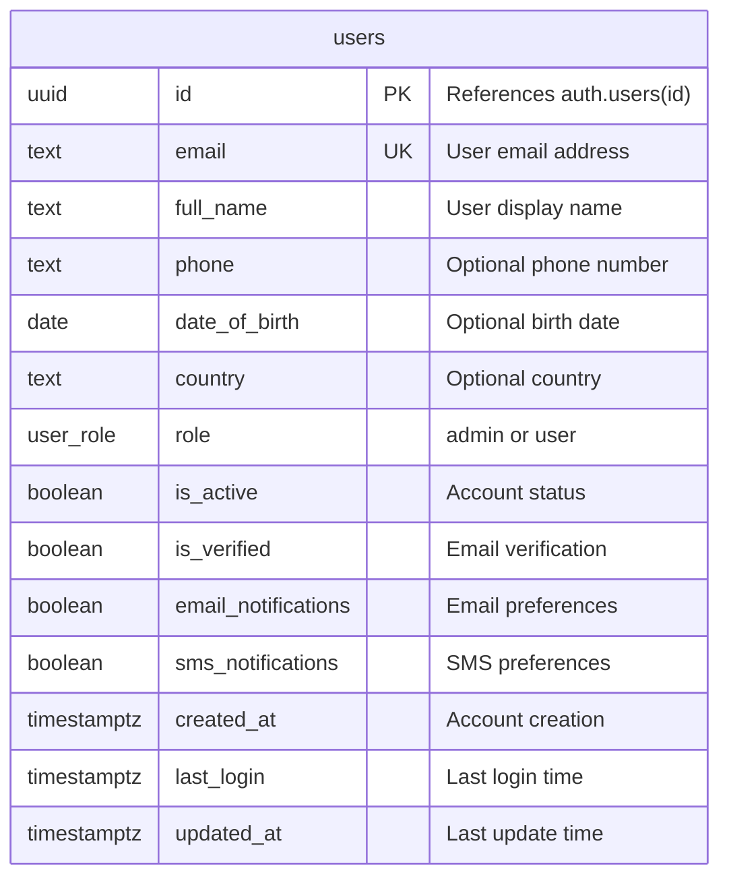

### Database Query Enhancements

#### Robust Profile Loading

The enhanced profile loading implements:
- **Retry Logic**: Automatic retry for transient database errors
- **Missing Profile Creation**: Automatic profile creation for authenticated users
- **Error Classification**: Distinguishes between retryable and permanent errors
- **Connection Validation**: Validates database connection before queries

#### Admin User Management

- **Role Verification**: Validates admin role from database
- **Profile Synchronization**: Ensures auth.users and public.users consistency
- **Permission Caching**: Caches admin permissions for performance

## Error Handling & Recovery

### Error Classification System

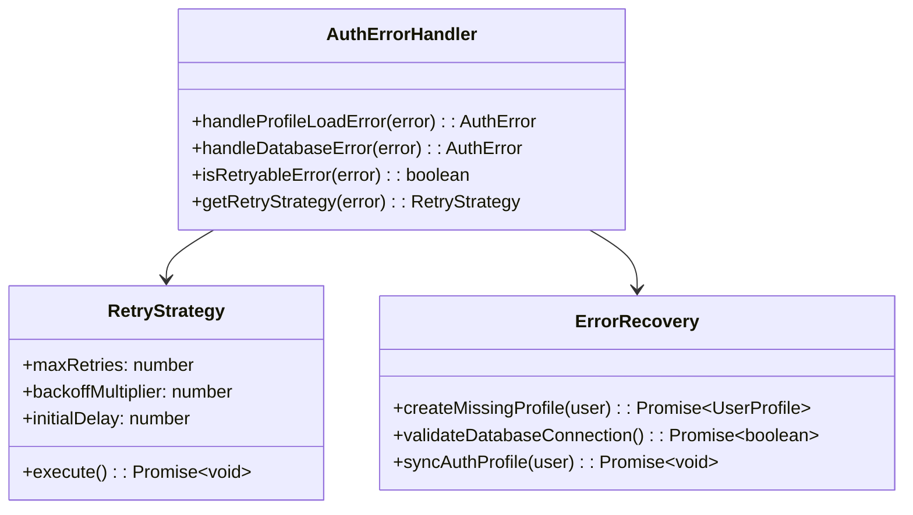

### Error Recovery Mechanisms

1. **Missing Profile Recovery**
   - Detects PGRST116 (not found) errors
   - Creates default admin profile for authenticated users
   - Syncs with Supabase Auth metadata

2. **Database Connection Recovery**
   - Implements exponential backoff for retries
   - Validates connection health
   - Falls back to cached user data

3. **Session Recovery**
   - Refreshes expired sessions automatically
   - Handles token refresh errors
   - Maintains authentication state consistency

## Admin Panel Access Control

### Role-Based Access Implementation

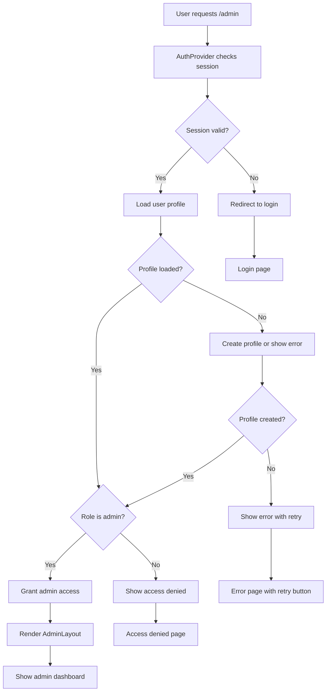

### Admin Authentication Features

1. **Secure Admin Detection**
   - Validates admin role from database
   - Prevents role tampering
   - Implements proper authorization checks

2. **Session Management**
   - Automatic session refresh
   - Secure session storage
   - Session invalidation on logout

3. **Admin User Creation**
   - Automatic profile creation for missing admin users
   - Role assignment from Supabase Auth metadata
   - Default admin permissions setup

## Business Logic Layer

### Authentication Service Enhancements

#### Improved Login Flow

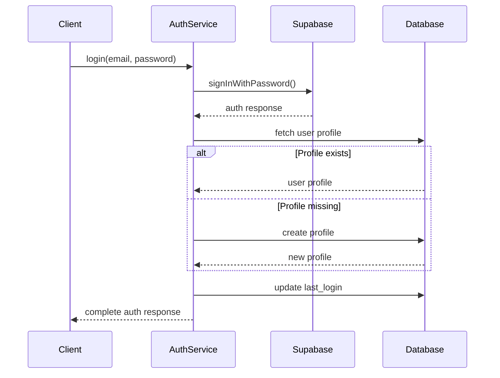

#### Profile Management

1. **Profile Creation Logic**
   - Creates missing profiles for authenticated users
   - Assigns appropriate roles based on email domains or metadata
   - Sets default preferences and permissions

2. **Profile Synchronization**
   - Syncs Supabase Auth data with database profile
   - Updates profile information on login
   - Maintains data consistency

3. **Admin Role Management**
   - Validates admin role assignments
   - Implements role-based feature toggles
   - Manages admin permissions

## Middleware & Security

### Authentication Middleware

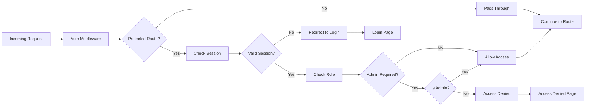

### Security Implementation

1. **Session Security**
   - Secure cookie configuration
   - CSRF protection
   - XSS prevention headers

2. **Database Security**
   - Row Level Security (RLS) policies
   - Prepared statements for queries
   - Input validation and sanitization

3. **Admin Security**
   - Multi-factor authentication support
   - Audit logging for admin actions
   - Rate limiting for admin endpoints

## Testing Strategy

### Unit Testing

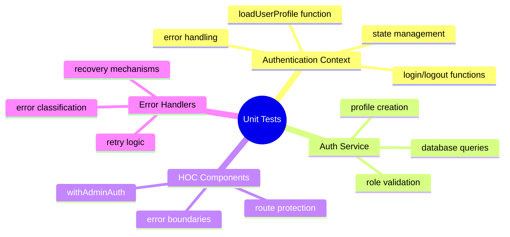

### Integration Testing

1. **Authentication Flow Tests**
   - Complete login/logout cycles
   - Profile creation and loading
   - Admin role verification

2. **Database Integration Tests**
   - User profile CRUD operations
   - Error handling scenarios
   - Connection resilience

3. **Admin Panel Tests**
   - Route protection functionality
   - Role-based access control
   - Error recovery workflows

### End-to-End Testing

1. **Admin Access Scenarios**
   - Fresh admin user login
   - Existing admin user access
   - Non-admin user restriction

2. **Error Recovery Scenarios**
   - Database connection failures
   - Missing profile recovery
   - Session expiration handling

3. **Security Testing**
   - Unauthorized access attempts
   - Role escalation prevention
   - Session security validation