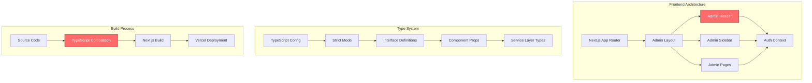
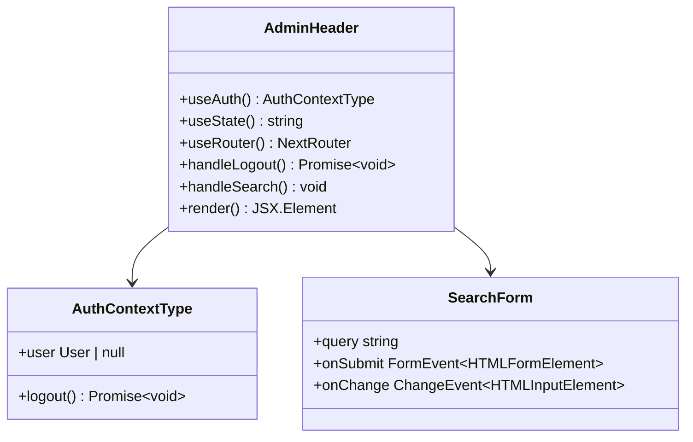
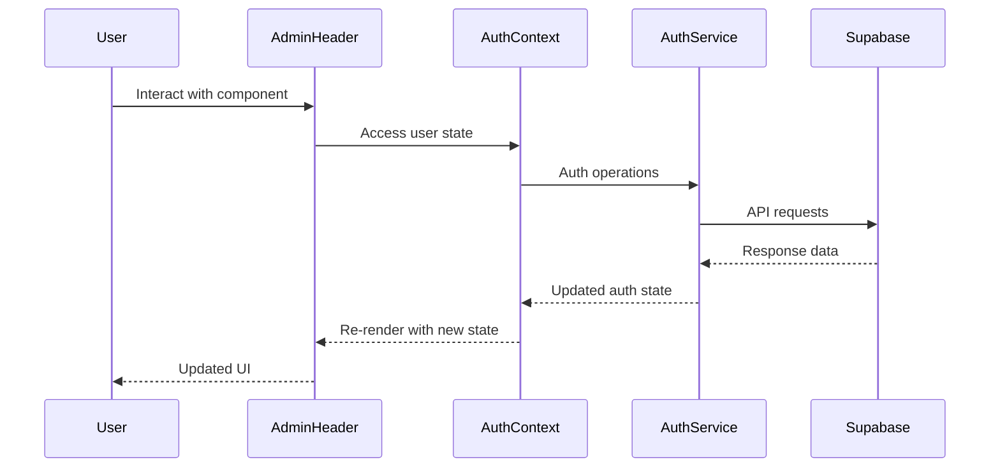

# Admin Header Fix - TypeScript Compilation and Deployment Error Resolution

## Overview

This design document addresses critical TypeScript compilation errors preventing successful deployment to Vercel. The primary issue is syntax errors in JSX className attributes using escaped quotes instead of proper JSX syntax, along with comprehensive type safety improvements across the application.

## Architecture

The application follows a Next.js 15 frontend architecture with TypeScript, using:
- **Frontend Framework**: Next.js 15 with App Router
- **UI Library**: Custom components with Tailwind CSS
- **State Management**: React Context (AuthContext)
- **Backend**: Supabase
- **Type System**: TypeScript 5 with strict mode



## Critical Issues Identified

### 1. JSX Syntax Errors

**Location**: `/components/admin/admin-header.tsx`

**Problem**: Using escaped quotes (`\"`) in JSX className attributes instead of proper JSX syntax.

**Example of Current Error**:
```typescript
// ❌ INCORRECT - Causing compilation failure
<header className=\"bg-card border-b border-border px-6 py-4\">
```

**Required Fix**:
```typescript
// ✅ CORRECT - Proper JSX syntax
<header className="bg-card border-b border-border px-6 py-4">
```

### 2. Type Safety Gaps

**Areas Requiring Attention**:
- Event handler type definitions
- Props interface completeness  
- Service layer return types
- Context type consistency

## Component Architecture Fixes

### Admin Header Component

**Current State**: Contains 46 instances of escaped quote syntax errors
**Dependencies**:
- Auth Context for user state
- UI components (Button, DropdownMenu, Badge, Input)
- Lucide React icons
- Next.js navigation hooks

**Required Changes**:



### Component Interface Definitions

**Enhanced Type Safety**:

```typescript
interface AdminHeaderProps {
  className?: string;
  onSearchSubmit?: (query: string) => void;
}

interface NotificationItem {
  id: string;
  type: 'booking' | 'payment' | 'user';
  title: string;
  description: string;
  timestamp: Date;
  read: boolean;
}

interface UserMenuProps {
  user: User;
  onLogout: () => Promise<void>;
}
```

## Data Flow Architecture



## Testing Strategy

### Unit Testing Requirements

**Component Testing**:
```typescript
// Test suite structure
describe('AdminHeader', () => {
  describe('Authentication Integration', () => {
    test('displays user information when authenticated')
    test('handles logout correctly')
    test('redirects on logout')
  })
  
  describe('Search Functionality', () => {
    test('submits search query')
    test('clears search input')
    test('handles empty search')
  })
  
  describe('Notifications', () => {
    test('displays notification count')
    test('renders notification items')
    test('marks notifications as read')
  })
})
```

**Type Safety Testing**:
- Compile-time type checking
- Props validation
- Event handler type compliance
- Context consumer type safety

### Integration Testing

**Admin Layout Integration**:
```typescript
describe('Admin Layout Integration', () => {
  test('AdminHeader renders within layout')
  test('Auth context provides required data')
  test('Navigation state syncs correctly')
})
```

## Error Resolution Strategy

### Phase 1: Immediate Syntax Fixes

**Priority**: Critical (Blocking deployment)

1. **Quote Syntax Correction**
   - Replace all escaped quotes in JSX className attributes
   - Ensure consistent quote usage across components
   - Validate JSX syntax compliance

2. **TypeScript Strict Mode Compliance**
   - Add missing type annotations
   - Resolve implicit any types
   - Fix type compatibility issues

### Phase 2: Type Safety Enhancement

**Priority**: High (Code quality improvement)

1. **Interface Definitions**
   - Define comprehensive component props interfaces
   - Add service layer type definitions
   - Implement strict event handler typing

2. **Context Type Improvements**
   - Enhance AuthContext type definitions
   - Add type guards for user role checking
   - Implement type-safe context consumers

### Phase 3: Build Process Optimization

**Priority**: Medium (Performance improvement)

1. **Compilation Optimization**
   - Configure TypeScript for faster builds
   - Implement incremental compilation
   - Optimize type checking performance

2. **Deployment Pipeline**
   - Add pre-deployment type checking
   - Implement automated syntax validation
   - Configure build error reporting

## Implementation Requirements

### File Modifications

**Primary Files**:
- `/components/admin/admin-header.tsx` - Critical syntax fixes
- `/components/admin/admin-sidebar.tsx` - Type enhancement
- `/contexts/auth-context.tsx` - Type definition improvements
- `/app/admin/layout.tsx` - Integration type safety

**Supporting Files**:
- `/services/admin-service.ts` - Return type definitions
- `/services/auth-service.ts` - Interface completeness
- `tsconfig.json` - Compiler option optimization

### Development Environment Setup

**Required Tools**:
- TypeScript 5.x with strict mode
- ESLint with TypeScript rules
- Prettier for code formatting
- VS Code with TypeScript extension

**Build Configuration**:
```json
{
  "compilerOptions": {
    "strict": true,
    "noImplicitAny": true,
    "strictNullChecks": true,
    "strictFunctionTypes": true,
    "noImplicitReturns": true,
    "noUnusedLocals": true,
    "noUnusedParameters": true
  }
}
```

## Quality Assurance

### Code Review Checklist

**Syntax Validation**:
- [ ] All JSX className attributes use proper quotes
- [ ] No escaped quotes in JSX elements
- [ ] Consistent quote usage throughout files
- [ ] Valid TypeScript syntax

**Type Safety Verification**:
- [ ] All component props have type definitions
- [ ] Event handlers properly typed
- [ ] Context consumers type-safe
- [ ] Service layer methods return typed results

**Build Verification**:
- [ ] Local TypeScript compilation successful
- [ ] Next.js build completes without errors
- [ ] Vercel deployment preview works
- [ ] All components render correctly

### Deployment Validation

**Pre-deployment Steps**:
1. Run `npm run type-check`
2. Execute `npm run build`
3. Verify build output integrity
4. Test critical admin functionality
5. Validate authentication flows

**Post-deployment Verification**:
1. Admin header renders correctly
2. User authentication works
3. Navigation functions properly
4. Search functionality operational
5. Notification system active