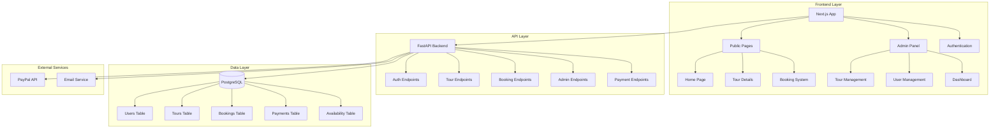
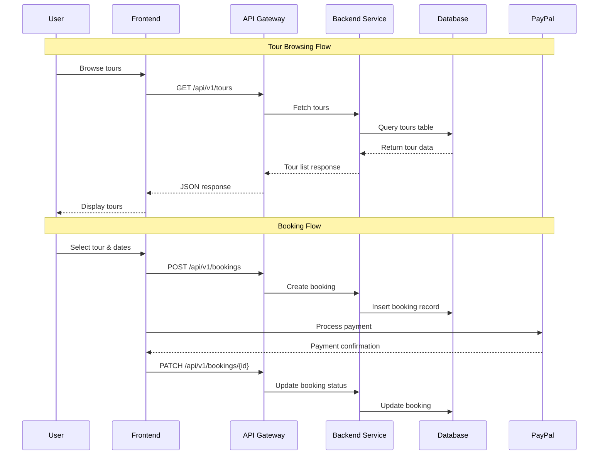
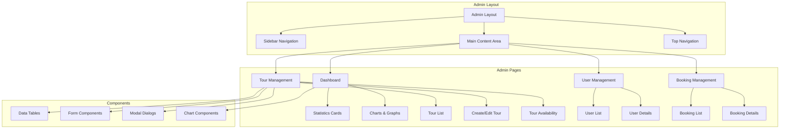

# Frontend-Backend Integration and Admin Panel Design

## Overview

This design document outlines the integration of the existing Next.js frontend with the FastAPI backend, ensuring full site functionality and implementing an administrative panel for tour management. The solution provides seamless data flow between frontend and backend while maintaining the existing UI/UX design.

## Technology Stack & Dependencies

### Frontend Technologies
- **Framework**: Next.js 15.2.4 (App Router)
- **Language**: TypeScript
- **UI Components**: Radix UI + Custom Components
- **Styling**: Tailwind CSS
- **State Management**: React Context API + React Query
- **HTTP Client**: Axios
- **Form Handling**: React Hook Form + Zod
- **Authentication**: JWT with HTTP-only cookies

### Backend Technologies
- **Framework**: FastAPI (Python)
- **Database**: PostgreSQL with SQLAlchemy ORM
- **Authentication**: JWT with bcrypt password hashing
- **API Documentation**: OpenAPI/Swagger
- **Payment Processing**: PayPal Integration

## Architecture

### System Architecture Overview



### Data Flow Architecture



## Frontend Implementation

### API Integration Layer

#### HTTP Client Configuration
```typescript
// lib/api-client.ts
import axios from 'axios'

const apiClient = axios.create({
  baseURL: process.env.NEXT_PUBLIC_API_URL || 'http://localhost:8000/api/v1',
  withCredentials: true,
  headers: {
    'Content-Type': 'application/json',
  },
})

// Request interceptor for auth tokens
apiClient.interceptors.request.use((config) => {
  const token = localStorage.getItem('access_token')
  if (token) {
    config.headers.Authorization = `Bearer ${token}`
  }
  return config
})

// Response interceptor for token refresh
apiClient.interceptors.response.use(
  (response) => response,
  async (error) => {
    if (error.response?.status === 401) {
      // Handle token refresh logic
      const refreshToken = localStorage.getItem('refresh_token')
      if (refreshToken) {
        try {
          const response = await axios.post('/auth/refresh', {
            refresh_token: refreshToken
          })
          const { access_token } = response.data
          localStorage.setItem('access_token', access_token)
          error.config.headers.Authorization = `Bearer ${access_token}`
          return apiClient.request(error.config)
        } catch (refreshError) {
          // Redirect to login
          window.location.href = '/auth/login'
        }
      }
    }
    return Promise.reject(error)
  }
)
```

#### Tour Service Implementation
```typescript
// services/tour-service.ts
export interface Tour {
  id: string
  title: string
  description: string
  city: string
  location: string
  price: number
  original_price?: number
  discount_percentage?: number
  rating: number
  review_count: number
  images: string[]
  max_group_size: number
  duration_hours: number
  is_featured: boolean
  is_active: boolean
}

export interface TourFilters {
  city?: string
  search?: string
  min_price?: number
  max_price?: number
  min_rating?: number
  has_availability?: boolean
}

export class TourService {
  static async getTours(filters: TourFilters = {}, page = 1, size = 12) {
    const params = new URLSearchParams({
      page: page.toString(),
      size: size.toString(),
      ...Object.fromEntries(
        Object.entries(filters).filter(([_, value]) => value !== undefined)
      )
    })
    
    const response = await apiClient.get(`/tours?${params}`)
    return response.data
  }
  
  static async getTour(id: string) {
    const response = await apiClient.get(`/tours/${id}`)
    return response.data
  }
  
  static async getFeaturedTours(limit = 6) {
    const response = await apiClient.get(`/tours/featured?limit=${limit}`)
    return response.data
  }
  
  static async getCities() {
    const response = await apiClient.get('/tours/cities')
    return response.data
  }
}
```

### Component Updates

#### Updated Home Page Component
```typescript
// app/page.tsx
'use client'

import { useQuery } from '@tanstack/react-query'
import { TourService } from '@/services/tour-service'
import { TourGrid } from '@/components/tour-grid'
import { CityFilter } from '@/components/city-filter'
import { SearchBar } from '@/components/search-bar'

export default function HomePage() {
  const [selectedCity, setSelectedCity] = useState<string>('')
  const [searchTerm, setSearchTerm] = useState<string>('')
  
  const { data: cities } = useQuery({
    queryKey: ['cities'],
    queryFn: TourService.getCities
  })
  
  const { data: toursData, isLoading } = useQuery({
    queryKey: ['tours', selectedCity, searchTerm],
    queryFn: () => TourService.getTours({
      city: selectedCity || undefined,
      search: searchTerm || undefined
    })
  })
  
  return (
    <div className="min-h-screen">
      <HeroSection onSearch={setSearchTerm} />
      
      <section className="py-16 px-4">
        <div className="max-w-7xl mx-auto">
          <CityFilter 
            cities={cities || []}
            selectedCity={selectedCity}
            onCityChange={setSelectedCity}
          />
          
          {isLoading ? (
            <TourGridSkeleton />
          ) : (
            <TourGrid tours={toursData?.items || []} />
          )}
        </div>
      </section>
    </div>
  )
}
```

#### Authentication Context
```typescript
// contexts/auth-context.tsx
interface AuthContextType {
  user: User | null
  login: (email: string, password: string) => Promise<void>
  logout: () => void
  isAuthenticated: boolean
  isAdmin: boolean
  isLoading: boolean
}

export const AuthProvider: React.FC<{ children: ReactNode }> = ({ children }) => {
  const [user, setUser] = useState<User | null>(null)
  const [isLoading, setIsLoading] = useState(true)
  
  useEffect(() => {
    const initAuth = async () => {
      const token = localStorage.getItem('access_token')
      if (token) {
        try {
          const response = await apiClient.get('/auth/me')
          setUser(response.data)
        } catch (error) {
          localStorage.removeItem('access_token')
          localStorage.removeItem('refresh_token')
        }
      }
      setIsLoading(false)
    }
    
    initAuth()
  }, [])
  
  const login = async (email: string, password: string) => {
    const response = await apiClient.post('/auth/login', { email, password })
    const { access_token, refresh_token, user } = response.data
    
    localStorage.setItem('access_token', access_token)
    localStorage.setItem('refresh_token', refresh_token)
    setUser(user)
  }
  
  const logout = () => {
    localStorage.removeItem('access_token')
    localStorage.removeItem('refresh_token')
    setUser(null)
  }
  
  return (
    <AuthContext.Provider value={{
      user,
      login,
      logout,
      isAuthenticated: !!user,
      isAdmin: user?.role === 'admin',
      isLoading
    }}>
      {children}
    </AuthContext.Provider>
  )
}
```

## Admin Panel Implementation

### Admin Panel Architecture



### Admin Dashboard Page

```typescript
// app/admin/dashboard/page.tsx
'use client'

export default function AdminDashboard() {
  const { data: stats, isLoading } = useQuery({
    queryKey: ['admin-dashboard-stats'],
    queryFn: AdminService.getDashboardStats
  })
  
  if (isLoading) return <DashboardSkeleton />
  
  return (
    <div className="space-y-6">
      <div className="flex justify-between items-center">
        <h1 className="text-3xl font-bold">Dashboard</h1>
        <RefreshButton />
      </div>
      
      {/* Statistics Cards */}
      <div className="grid grid-cols-1 md:grid-cols-2 lg:grid-cols-4 gap-6">
        <StatCard
          title="Total Tours"
          value={stats?.total_tours}
          icon={MapPin}
          trend={{ value: 12, isPositive: true }}
        />
        <StatCard
          title="Total Bookings"
          value={stats?.total_bookings}
          icon={Calendar}
          trend={{ value: 8, isPositive: true }}
        />
        <StatCard
          title="Total Revenue"
          value={`$${stats?.total_revenue?.toLocaleString()}`}
          icon={DollarSign}
          trend={{ value: 15, isPositive: true }}
        />
        <StatCard
          title="Active Users"
          value={stats?.total_users}
          icon={Users}
          trend={{ value: 5, isPositive: true }}
        />
      </div>
      
      {/* Charts */}
      <div className="grid grid-cols-1 lg:grid-cols-2 gap-6">
        <RevenueChart data={stats?.revenue_chart} />
        <BookingsChart data={stats?.bookings_chart} />
      </div>
      
      {/* Recent Activity */}
      <RecentActivity />
    </div>
  )
}
```

### Tour Management Interface

```typescript
// app/admin/tours/page.tsx
'use client'

export default function TourManagement() {
  const [filters, setFilters] = useState<TourFilters>({})
  const [selectedTours, setSelectedTours] = useState<string[]>([])
  
  const { data: toursData, isLoading, refetch } = useQuery({
    queryKey: ['admin-tours', filters],
    queryFn: () => AdminService.getTours(filters)
  })
  
  const deleteTourMutation = useMutation({
    mutationFn: AdminService.deleteTour,
    onSuccess: () => {
      refetch()
      toast.success('Tour deleted successfully')
    }
  })
  
  const bulkUpdateMutation = useMutation({
    mutationFn: AdminService.bulkUpdateTours,
    onSuccess: () => {
      refetch()
      setSelectedTours([])
      toast.success('Tours updated successfully')
    }
  })
  
  return (
    <div className="space-y-6">
      <div className="flex justify-between items-center">
        <h1 className="text-3xl font-bold">Tour Management</h1>
        <div className="flex gap-2">
          <Button onClick={() => setIsCreateModalOpen(true)}>
            <Plus className="w-4 h-4 mr-2" />
            Create Tour
          </Button>
          <ImportToursButton />
        </div>
      </div>
      
      {/* Filters */}
      <TourFilters filters={filters} onFiltersChange={setFilters} />
      
      {/* Bulk Actions */}
      {selectedTours.length > 0 && (
        <BulkActionsBar
          selectedCount={selectedTours.length}
          onBulkUpdate={bulkUpdateMutation.mutate}
          onBulkDelete={() => {/* Handle bulk delete */}}
        />
      )}
      
      {/* Tour Table */}
      <DataTable
        columns={tourColumns}
        data={toursData?.items || []}
        loading={isLoading}
        selectable
        selectedRows={selectedTours}
        onSelectionChange={setSelectedTours}
        pagination={{
          page: toursData?.meta.page || 1,
          totalPages: toursData?.meta.pages || 1,
          onPageChange: (page) => setFilters(prev => ({ ...prev, page }))
        }}
      />
      
      {/* Modals */}
      <CreateTourModal
        open={isCreateModalOpen}
        onClose={() => setIsCreateModalOpen(false)}
        onSuccess={refetch}
      />
    </div>
  )
}
```

### Tour Form Component

```typescript
// components/admin/tour-form.tsx
interface TourFormData {
  title: string
  description: string
  city: string
  location: string
  price: number
  original_price?: number
  discount_percentage?: number
  max_group_size: number
  duration_hours: number
  images: File[]
  is_featured: boolean
  is_active: boolean
}

export const TourForm: React.FC<TourFormProps> = ({ 
  initialData, 
  onSubmit, 
  isLoading 
}) => {
  const form = useForm<TourFormData>({
    resolver: zodResolver(tourSchema),
    defaultValues: initialData || {
      title: '',
      description: '',
      city: '',
      location: '',
      price: 0,
      max_group_size: 10,
      duration_hours: 2,
      images: [],
      is_featured: false,
      is_active: true
    }
  })
  
  return (
    <Form {...form}>
      <form onSubmit={form.handleSubmit(onSubmit)} className="space-y-6">
        <div className="grid grid-cols-1 md:grid-cols-2 gap-6">
          <FormField
            control={form.control}
            name="title"
            render={({ field }) => (
              <FormItem>
                <FormLabel>Tour Title</FormLabel>
                <FormControl>
                  <Input placeholder="Enter tour title" {...field} />
                </FormControl>
                <FormMessage />
              </FormItem>
            )}
          />
          
          <FormField
            control={form.control}
            name="city"
            render={({ field }) => (
              <FormItem>
                <FormLabel>City</FormLabel>
                <Select onValueChange={field.onChange} defaultValue={field.value}>
                  <FormControl>
                    <SelectTrigger>
                      <SelectValue placeholder="Select city" />
                    </SelectTrigger>
                  </FormControl>
                  <SelectContent>
                    <SelectItem value="cusco">Cusco</SelectItem>
                    <SelectItem value="lima">Lima</SelectItem>
                    <SelectItem value="arequipa">Arequipa</SelectItem>
                    <SelectItem value="ica">Ica</SelectItem>
                    <SelectItem value="puno">Puno</SelectItem>
                  </SelectContent>
                </Select>
                <FormMessage />
              </FormItem>
            )}
          />
        </div>
        
        <FormField
          control={form.control}
          name="description"
          render={({ field }) => (
            <FormItem>
              <FormLabel>Description</FormLabel>
              <FormControl>
                <Textarea 
                  placeholder="Enter tour description"
                  className="min-h-[100px]"
                  {...field} 
                />
              </FormControl>
              <FormMessage />
            </FormItem>
          )}
        />
        
        <div className="grid grid-cols-1 md:grid-cols-3 gap-6">
          <FormField
            control={form.control}
            name="price"
            render={({ field }) => (
              <FormItem>
                <FormLabel>Price ($)</FormLabel>
                <FormControl>
                  <Input 
                    type="number" 
                    step="0.01" 
                    placeholder="0.00"
                    {...field}
                    onChange={(e) => field.onChange(parseFloat(e.target.value))}
                  />
                </FormControl>
                <FormMessage />
              </FormItem>
            )}
          />
          
          <FormField
            control={form.control}
            name="max_group_size"
            render={({ field }) => (
              <FormItem>
                <FormLabel>Max Group Size</FormLabel>
                <FormControl>
                  <Input 
                    type="number" 
                    placeholder="10"
                    {...field}
                    onChange={(e) => field.onChange(parseInt(e.target.value))}
                  />
                </FormControl>
                <FormMessage />
              </FormItem>
            )}
          />
          
          <FormField
            control={form.control}
            name="duration_hours"
            render={({ field }) => (
              <FormItem>
                <FormLabel>Duration (hours)</FormLabel>
                <FormControl>
                  <Input 
                    type="number" 
                    placeholder="2"
                    {...field}
                    onChange={(e) => field.onChange(parseInt(e.target.value))}
                  />
                </FormControl>
                <FormMessage />
              </FormItem>
            )}
          />
        </div>
        
        <ImageUpload
          value={form.watch('images')}
          onChange={(files) => form.setValue('images', files)}
          maxFiles={5}
        />
        
        <div className="flex items-center space-x-6">
          <FormField
            control={form.control}
            name="is_featured"
            render={({ field }) => (
              <FormItem className="flex flex-row items-center space-x-3 space-y-0">
                <FormControl>
                  <Checkbox
                    checked={field.value}
                    onCheckedChange={field.onChange}
                  />
                </FormControl>
                <div className="space-y-1 leading-none">
                  <FormLabel>Featured Tour</FormLabel>
                </div>
              </FormItem>
            )}
          />
          
          <FormField
            control={form.control}
            name="is_active"
            render={({ field }) => (
              <FormItem className="flex flex-row items-center space-x-3 space-y-0">
                <FormControl>
                  <Checkbox
                    checked={field.value}
                    onCheckedChange={field.onChange}
                  />
                </FormControl>
                <div className="space-y-1 leading-none">
                  <FormLabel>Active</FormLabel>
                </div>
              </FormItem>
            )}
          />
        </div>
        
        <div className="flex justify-end space-x-4">
          <Button type="button" variant="outline" onClick={() => form.reset()}>
            Reset
          </Button>
          <Button type="submit" disabled={isLoading}>
            {isLoading ? 'Saving...' : 'Save Tour'}
          </Button>
        </div>
      </form>
    </Form>
  )
}
```

## Backend Integration Points

### API Endpoints Summary

| Endpoint | Method | Purpose | Auth Required |
|----------|--------|---------|---------------|
| `/tours` | GET | Get paginated tours list | No |
| `/tours/{id}` | GET | Get tour details | No |
| `/tours/featured` | GET | Get featured tours | No |
| `/tours/cities` | GET | Get available cities | No |
| `/admin/tours` | GET | Get tours for admin | Admin |
| `/admin/tours` | POST | Create new tour | Admin |
| `/admin/tours/{id}` | PUT | Update tour | Admin |
| `/admin/tours/{id}` | DELETE | Delete tour | Admin |
| `/admin/dashboard` | GET | Get dashboard stats | Admin |
| `/bookings` | POST | Create booking | User |
| `/bookings` | GET | Get user bookings | User |
| `/auth/login` | POST | User authentication | No |
| `/auth/register` | POST | User registration | No |

### Database Schema Updates

```sql
-- Tours table enhancements
ALTER TABLE tours ADD COLUMN IF NOT EXISTS is_featured BOOLEAN DEFAULT FALSE;
ALTER TABLE tours ADD COLUMN IF NOT EXISTS created_by UUID REFERENCES users(id);
ALTER TABLE tours ADD COLUMN IF NOT EXISTS updated_by UUID REFERENCES users(id);

-- Admin audit log table
CREATE TABLE IF NOT EXISTS admin_audit_logs (
    id UUID PRIMARY KEY DEFAULT gen_random_uuid(),
    admin_id UUID NOT NULL REFERENCES users(id),
    action VARCHAR(50) NOT NULL,
    resource_type VARCHAR(50) NOT NULL,
    resource_id UUID,
    old_values JSONB,
    new_values JSONB,
    ip_address INET,
    user_agent TEXT,
    created_at TIMESTAMP WITH TIME ZONE DEFAULT NOW()
);

-- Tour images table
CREATE TABLE IF NOT EXISTS tour_images (
    id UUID PRIMARY KEY DEFAULT gen_random_uuid(),
    tour_id UUID NOT NULL REFERENCES tours(id) ON DELETE CASCADE,
    image_url VARCHAR(500) NOT NULL,
    alt_text VARCHAR(200),
    is_primary BOOLEAN DEFAULT FALSE,
    sort_order INTEGER DEFAULT 0,
    created_at TIMESTAMP WITH TIME ZONE DEFAULT NOW()
);
```

## Authentication & Authorization

### JWT Implementation

```typescript
// middleware/auth.ts
export async function authMiddleware(req: NextRequest) {
  const token = req.cookies.get('access_token')?.value || 
                req.headers.get('authorization')?.replace('Bearer ', '')
  
  if (!token) {
    return NextResponse.redirect(new URL('/auth/login', req.url))
  }
  
  try {
    const payload = jwt.verify(token, process.env.JWT_SECRET!)
    const user = await getUserById(payload.sub)
    
    if (!user || !user.is_active) {
      return NextResponse.redirect(new URL('/auth/login', req.url))
    }
    
    // Add user to request headers
    const response = NextResponse.next()
    response.headers.set('x-user-id', user.id)
    response.headers.set('x-user-role', user.role)
    
    return response
  } catch (error) {
    return NextResponse.redirect(new URL('/auth/login', req.url))
  }
}

export const config = {
  matcher: ['/admin/:path*', '/profile/:path*', '/bookings/:path*']
}
```

### Role-Based Access Control

```typescript
// hooks/use-auth.ts
export const useAuthGuard = (requiredRole?: UserRole) => {
  const { user, isLoading } = useAuth()
  const router = useRouter()
  
  useEffect(() => {
    if (!isLoading) {
      if (!user) {
        router.push('/auth/login')
        return
      }
      
      if (requiredRole && user.role !== requiredRole && user.role !== 'admin') {
        router.push('/unauthorized')
        return
      }
    }
  }, [user, isLoading, requiredRole, router])
  
  return { user, isLoading, isAuthorized: !!user }
}

// components/admin/admin-guard.tsx
export const AdminGuard: React.FC<{ children: ReactNode }> = ({ children }) => {
  const { isAuthorized, isLoading } = useAuthGuard('admin')
  
  if (isLoading) {
    return <LoadingSpinner />
  }
  
  if (!isAuthorized) {
    return <UnauthorizedPage />
  }
  
  return <>{children}</>
}
```

## State Management

### React Query Configuration

```typescript
// lib/react-query.ts
export const queryClient = new QueryClient({
  defaultOptions: {
    queries: {
      staleTime: 5 * 60 * 1000, // 5 minutes
      cacheTime: 10 * 60 * 1000, // 10 minutes
      retry: (failureCount, error) => {
        if (error.status === 404) return false
        return failureCount < 3
      },
    },
    mutations: {
      retry: 1,
    },
  },
})

// Query keys factory
export const queryKeys = {
  tours: {
    all: ['tours'] as const,
    lists: () => [...queryKeys.tours.all, 'list'] as const,
    list: (filters: TourFilters) => [...queryKeys.tours.lists(), filters] as const,
    details: () => [...queryKeys.tours.all, 'detail'] as const,
    detail: (id: string) => [...queryKeys.tours.details(), id] as const,
  },
  admin: {
    all: ['admin'] as const,
    dashboard: () => [...queryKeys.admin.all, 'dashboard'] as const,
    users: () => [...queryKeys.admin.all, 'users'] as const,
    tours: () => [...queryKeys.admin.all, 'tours'] as const,
  },
}
```

## Testing Strategy

### Unit Testing

```typescript
// __tests__/services/tour-service.test.ts
describe('TourService', () => {
  beforeEach(() => {
    mock.reset()
  })
  
  it('should fetch tours with filters', async () => {
    const mockTours = { items: [], meta: { total: 0 } }
    mock.onGet('/tours').reply(200, mockTours)
    
    const result = await TourService.getTours({ city: 'cusco' })
    
    expect(result).toEqual(mockTours)
    expect(mock.history.get[0].params).toEqual({
      page: '1',
      size: '12',
      city: 'cusco'
    })
  })
  
  it('should handle API errors gracefully', async () => {
    mock.onGet('/tours').reply(500)
    
    await expect(TourService.getTours()).rejects.toThrow()
  })
})
```

### Integration Testing

```typescript
// __tests__/pages/admin/tours.test.tsx
describe('Admin Tours Page', () => {
  it('should display tours list for admin user', async () => {
    const mockUser = { id: '1', role: 'admin', email: 'admin@test.com' }
    const mockTours = { items: [mockTour], meta: { total: 1 } }
    
    render(
      <QueryClientProvider client={testQueryClient}>
        <AuthProvider value={{ user: mockUser, isAuthenticated: true }}>
          <TourManagement />
        </AuthProvider>
      </QueryClientProvider>
    )
    
    await waitFor(() => {
      expect(screen.getByText('Tour Management')).toBeInTheDocument()
      expect(screen.getByText(mockTour.title)).toBeInTheDocument()
    })
  })
  
  it('should redirect non-admin users', () => {
    const mockUser = { id: '1', role: 'user', email: 'user@test.com' }
    
    render(
      <AuthProvider value={{ user: mockUser, isAuthenticated: true }}>
        <TourManagement />
      </AuthProvider>
    )
    
    expect(mockRouter.push).toHaveBeenCalledWith('/unauthorized')
  })
})
```