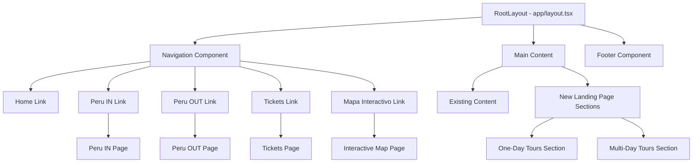
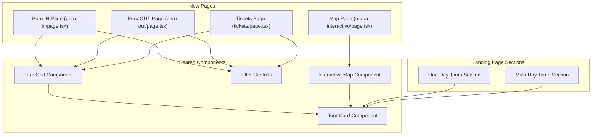
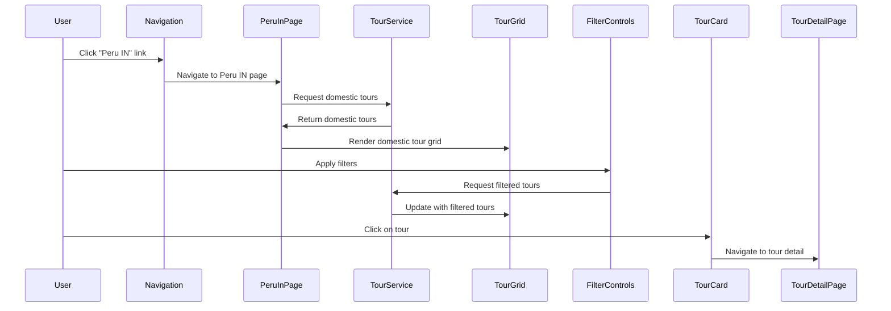
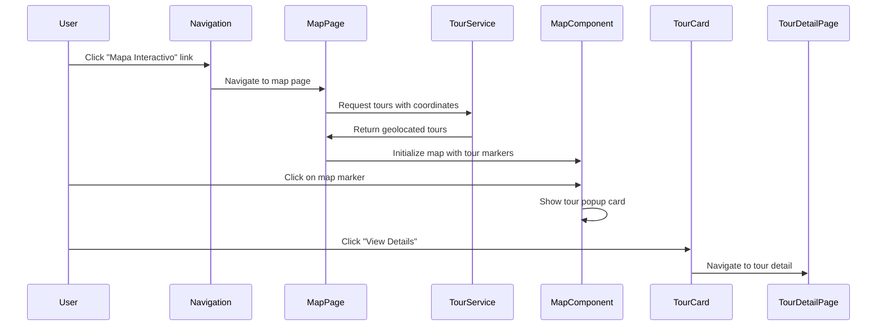

# Page Creation for Header Links Design Document

## Overview

This design document outlines the implementation of new pages for the Peru Travel application's header links: "Perú IN," "Perú OUT," "Tickets," and "Mapa Interactivo." Additionally, it covers enhancements to the landing page with new sections for one-day tours and multi-day tours. The application is built using Next.js and React with Tailwind CSS for styling.

## Architecture

### New Pages Structure



### Component Relationships



## Data Model Extensions

To support the new features, we'll need to extend the Tour data model to include additional properties:

| Property | Type | Description |
|----------|------|-------------|
| `location_type` | string | "domestic" (Peru IN) or "international" (Peru OUT) |
| `tour_type` | string | "tour" or "ticket" |
| `duration_days` | number | Duration of tour in days |
| `coordinates` | object | Contains lat/lng for map display |

## Page Implementations

### Peru IN Page

**Purpose**: Display all domestic tours within Peru.

**Implementation Details**:
- Route: `/peru-in`
- Filter tours with `location_type === "domestic"`
- Use existing Tour Grid component with filtered data
- Include city filters similar to the main page

**UI Composition**:
- Hero section with Peru domestic imagery
- Filter controls (cities, price, duration)
- Grid of tour cards showing domestic tours only

### Peru OUT Page

**Purpose**: Display all international tours departing from Peru.

**Implementation Details**:
- Route: `/peru-out`
- Filter tours with `location_type === "international"`
- Use existing Tour Grid component with filtered data
- Include country/destination filters

**UI Composition**:
- Hero section with international travel imagery
- Filter controls (destinations, price, duration)
- Grid of tour cards showing international tours only

### Tickets Page

**Purpose**: Display standalone tickets for attractions rather than guided tours.

**Implementation Details**:
- Route: `/tickets`
- Filter offerings with `tour_type === "ticket"`
- Custom card layout optimized for ticket display
- Sort by popularity and price options

**UI Composition**:
- Hero section highlighting ticket attractions
- Filter controls (location, price, attraction type)
- Grid of ticket cards with simplified information
- Special badge to indicate "Ticket Only" vs full tours

### Interactive Map Page

**Purpose**: Display tour and ticket locations on an interactive map of Peru.

**Implementation Details**:
- Route: `/mapa-interactivo`
- Integrate with Mapbox or Google Maps API
- Display markers for tour and ticket locations
- Show tour/ticket details in popups when markers are clicked

**UI Composition**:
- Full-width interactive map
- Legend showing tour/ticket types
- Filter controls for map display options
- Sidebar with scrollable list of locations
- Popup cards showing tour/ticket details when markers are selected

## Landing Page Enhancements

### One-Day Tours Section

**Purpose**: Showcase tours that can be completed in a single day.

**Implementation Details**:
- Filter tours with `duration_days <= 1`
- Horizontal scrollable section similar to existing Featured Tours
- Limited display (6-8 tours) with "View All" link to filtered page

**UI Composition**:
- Section title and description
- Horizontal scrollable card interface
- Navigation arrows for scrolling
- Card highlights showing short duration

### Multi-Day Tours Section

**Purpose**: Showcase tours that span multiple days.

**Implementation Details**:
- Filter tours with `duration_days > 1`
- Horizontal scrollable section similar to existing Featured Tours
- Limited display (6-8 tours) with "View All" link to filtered page

**UI Composition**:
- Section title and description
- Horizontal scrollable card interface
- Navigation arrows for scrolling
- Card highlights showing duration in days

## API Extensions

### Tour Service Extensions

```typescript
// Additional methods for TourService

// Get tours by location type (domestic/international)
static async getToursByLocationType(
  locationType: 'domestic' | 'international',
  filters: TourFilters = {},
  page = 1,
  size = 12
): Promise<PaginatedResponse<Tour>> {
  return this.getTours({ ...filters, location_type: locationType }, page, size);
}

// Get tickets only
static async getTickets(
  filters: TourFilters = {},
  page = 1,
  size = 12
): Promise<PaginatedResponse<Tour>> {
  return this.getTours({ ...filters, tour_type: 'ticket' }, page, size);
}

// Get tours by duration
static async getToursByDuration(
  maxDays: number | null = null,
  minDays: number | null = null,
  filters: TourFilters = {},
  page = 1,
  size = 12
): Promise<PaginatedResponse<Tour>> {
  const durationFilters = { ...filters };
  if (maxDays !== null) {
    durationFilters.max_days = maxDays;
  }
  if (minDays !== null) {
    durationFilters.min_days = minDays;
  }
  return this.getTours(durationFilters, page, size);
}

// Get tours with coordinates for map
static async getToursWithCoordinates(
  filters: TourFilters = {}
): Promise<Tour[]> {
  const supabase = createClient();
  
  let query = supabase
    .from('tours')
    .select('*')
    .eq('is_active', true)
    .not('coordinates', 'is', null)
    
  // Apply additional filters
  if (filters.location_type) {
    query = query.eq('location_type', filters.location_type);
  }
  
  if (filters.tour_type) {
    query = query.eq('tour_type', filters.tour_type);
  }
  
  const { data, error } = await query;
  
  if (error) {
    console.error('Error fetching tours with coordinates:', error);
    throw new Error(`Failed to fetch tours with coordinates: ${error.message}`);
  }
  
  return data || [];
}
```

## Component Design

### Tour Card Component

The existing Tour Card component will be enhanced to support different display modes:

```tsx
interface TourCardProps {
  tour: Tour;
  variant?: 'default' | 'compact' | 'ticket' | 'map';
  isCenter?: boolean;
}

export function TourCard({ tour, variant = 'default', isCenter = false }: TourCardProps) {
  // Render appropriate card based on variant type
  // - default: Full tour card with all details
  // - compact: Smaller card for horizontal scrolling
  // - ticket: Simplified card for ticket display
  // - map: Compact card for map popup
}
```

### Interactive Map Component

```tsx
interface MapComponentProps {
  tours: Tour[];
  initialCenter?: { lat: number; lng: number };
  initialZoom?: number;
  onMarkerClick?: (tour: Tour) => void;
  filters?: {
    tourType?: string[];
    locationType?: string[];
    showTickets?: boolean;
    showTours?: boolean;
  };
}

export function MapComponent({ tours, initialCenter, initialZoom = 6, onMarkerClick, filters }: MapComponentProps) {
  // Implementation of interactive map with markers for tours/tickets
}
```

## Responsive Design

All new pages will follow the existing responsive design patterns of the application:

| Breakpoint | Layout Behavior |
|------------|----------------|
| Mobile (<768px) | Single column layout, stacked components |
| Tablet (768-1023px) | Two column grid for tour cards |
| Desktop (1024px+) | Three or four column grid, full map features |

## UI Flow

### User Journey for Peru IN Page



### User Journey for Interactive Map



## Accessibility Considerations

- All new pages will maintain WCAG 2.1 AA compliance
- Interactive map will include keyboard navigation for markers
- Filter controls will have proper ARIA labels and roles
- Tour cards will maintain existing accessibility features
- High-contrast modes will be supported for map visualization

## Testing Strategy

| Test Type | Description | Key Test Cases |
|-----------|-------------|----------------|
| Unit Tests | Test individual components | Tour filtering by location type, ticket type, duration |
| Integration Tests | Test component interactions | Filter controls updating tour grid, Map marker interaction |
| Responsive Tests | Test layout at different screen sizes | Mobile/tablet/desktop breakpoints |
| Accessibility Tests | Test accessibility compliance | Keyboard navigation, screen reader compatibility |

## Implementation Plan

1. **Database Schema Updates**
   - Add new fields to tours table
   - Update existing tours with new field values

2. **API Extensions**
   - Implement new TourService methods
   - Test with sample data

3. **Page Creation**
   - Create basic page structures
   - Implement tour filtering logic
   - Build UI components

4. **Map Integration**
   - Set up map provider
   - Implement marker display logic
   - Create interactive popup components

5. **Landing Page Sections**
   - Add one-day tour section
   - Add multi-day tour section
   - Implement horizontal scrolling

6. **Testing & Refinement**
   - Test across devices and browsers
   - Optimize performance
   - Fix any UI/UX issues