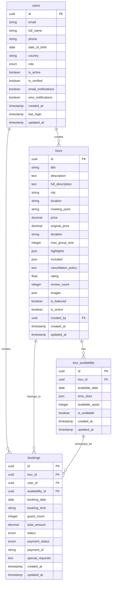

# Supabase Backend Implementation for Tour Management System

## Overview

This design document outlines the implementation of a Supabase backend for the tour management system to enable free deployment on Vercel + Supabase. The system will provide high-performance tour management, user authentication, booking system, and administrative functionality.

**Key Requirements:**
- Replace current FastAPI backend with Supabase
- Maintain existing frontend functionality
- Enable free cloud deployment (Vercel + Supabase)
- Ensure high performance and scalability
- Support comprehensive admin panel

## Technology Stack

### Backend Technologies
- **Supabase**: PostgreSQL database, Authentication, Real-time subscriptions, Edge Functions
- **Database**: PostgreSQL (managed by Supabase)
- **Authentication**: Supabase Auth with Row Level Security (RLS)
- **API**: Supabase REST API + Edge Functions for complex logic
- **File Storage**: Supabase Storage for tour images
- **Caching**: Supabase built-in caching + CDN

### Frontend Integration
- **Next.js 15**: App Router with server components
- **Supabase Client**: `@supabase/supabase-js` for API communication
- **Authentication**: Supabase Auth with Next.js middleware
- **Real-time**: Supabase Realtime for live updates

## Database Schema Design

### Core Tables Structure



### Table Definitions

#### Users Table (Extended from Supabase Auth)
```sql
CREATE TABLE public.users (
  id UUID REFERENCES auth.users(id) PRIMARY KEY,
  email TEXT UNIQUE NOT NULL,
  full_name TEXT NOT NULL,
  phone TEXT,
  date_of_birth DATE,
  country TEXT,
  role user_role DEFAULT 'user'::user_role,
  is_active BOOLEAN DEFAULT true,
  is_verified BOOLEAN DEFAULT false,
  email_notifications BOOLEAN DEFAULT true,
  sms_notifications BOOLEAN DEFAULT false,
  created_at TIMESTAMPTZ DEFAULT NOW(),
  last_login TIMESTAMPTZ,
  updated_at TIMESTAMPTZ DEFAULT NOW()
);

CREATE TYPE user_role AS ENUM ('admin', 'user');
```

#### Tours Table
```sql
CREATE TABLE public.tours (
  id UUID DEFAULT gen_random_uuid() PRIMARY KEY,
  title TEXT NOT NULL,
  description TEXT NOT NULL,
  full_description TEXT,
  city TEXT NOT NULL,
  location TEXT NOT NULL,
  meeting_point TEXT NOT NULL,
  price DECIMAL(10,2) NOT NULL,
  original_price DECIMAL(10,2),
  duration TEXT NOT NULL,
  max_group_size INTEGER NOT NULL,
  highlights JSONB DEFAULT '[]'::jsonb,
  included JSONB DEFAULT '[]'::jsonb,
  cancellation_policy TEXT NOT NULL,
  rating DECIMAL(3,2) DEFAULT 0,
  review_count INTEGER DEFAULT 0,
  images JSONB DEFAULT '[]'::jsonb,
  is_featured BOOLEAN DEFAULT false,
  is_active BOOLEAN DEFAULT true,
  created_by UUID REFERENCES public.users(id),
  created_at TIMESTAMPTZ DEFAULT NOW(),
  updated_at TIMESTAMPTZ DEFAULT NOW()
);
```

#### Tour Availability Table
```sql
CREATE TABLE public.tour_availability (
  id UUID DEFAULT gen_random_uuid() PRIMARY KEY,
  tour_id UUID REFERENCES public.tours(id) ON DELETE CASCADE,
  available_date DATE NOT NULL,
  time_slots JSONB NOT NULL DEFAULT '[]'::jsonb,
  available_spots INTEGER NOT NULL,
  is_available BOOLEAN DEFAULT true,
  created_at TIMESTAMPTZ DEFAULT NOW(),
  updated_at TIMESTAMPTZ DEFAULT NOW(),
  
  UNIQUE(tour_id, available_date)
);
```

#### Bookings Table
```sql
CREATE TABLE public.bookings (
  id UUID DEFAULT gen_random_uuid() PRIMARY KEY,
  tour_id UUID REFERENCES public.tours(id),
  user_id UUID REFERENCES public.users(id),
  availability_id UUID REFERENCES public.tour_availability(id),
  booking_date DATE NOT NULL,
  booking_time TEXT NOT NULL,
  guest_count INTEGER NOT NULL,
  total_amount DECIMAL(10,2) NOT NULL,
  status booking_status DEFAULT 'pending'::booking_status,
  payment_status payment_status DEFAULT 'pending'::payment_status,
  payment_id TEXT,
  special_requests TEXT,
  created_at TIMESTAMPTZ DEFAULT NOW(),
  updated_at TIMESTAMPTZ DEFAULT NOW()
);

CREATE TYPE booking_status AS ENUM ('pending', 'confirmed', 'cancelled', 'completed');
CREATE TYPE payment_status AS ENUM ('pending', 'paid', 'refunded', 'failed');
```

## Row Level Security (RLS) Policies

### Users Table Policies
```sql
-- Enable RLS
ALTER TABLE public.users ENABLE ROW LEVEL SECURITY;

-- Users can read their own profile
CREATE POLICY "Users can read own profile" ON public.users
  FOR SELECT USING (auth.uid() = id);

-- Users can update their own profile
CREATE POLICY "Users can update own profile" ON public.users
  FOR UPDATE USING (auth.uid() = id);

-- Admins can read all users
CREATE POLICY "Admins can read all users" ON public.users
  FOR SELECT USING (
    EXISTS (
      SELECT 1 FROM public.users 
      WHERE id = auth.uid() AND role = 'admin'
    )
  );
```

### Tours Table Policies
```sql
ALTER TABLE public.tours ENABLE ROW LEVEL SECURITY;

-- Anyone can read active tours
CREATE POLICY "Anyone can read active tours" ON public.tours
  FOR SELECT USING (is_active = true);

-- Admins can manage all tours
CREATE POLICY "Admins can manage tours" ON public.tours
  FOR ALL USING (
    EXISTS (
      SELECT 1 FROM public.users 
      WHERE id = auth.uid() AND role = 'admin'
    )
  );
```

### Bookings Table Policies
```sql
ALTER TABLE public.bookings ENABLE ROW LEVEL SECURITY;

-- Users can read their own bookings
CREATE POLICY "Users can read own bookings" ON public.bookings
  FOR SELECT USING (auth.uid() = user_id);

-- Users can create their own bookings
CREATE POLICY "Users can create bookings" ON public.bookings
  FOR INSERT WITH CHECK (auth.uid() = user_id);

-- Admins can read all bookings
CREATE POLICY "Admins can read all bookings" ON public.bookings
  FOR SELECT USING (
    EXISTS (
      SELECT 1 FROM public.users 
      WHERE id = auth.uid() AND role = 'admin'
    )
  );
```

## Frontend Integration

### Supabase Client Configuration

#### Environment Variables
```env
NEXT_PUBLIC_SUPABASE_URL=your_supabase_project_url
NEXT_PUBLIC_SUPABASE_ANON_KEY=your_supabase_anon_key
SUPABASE_SERVICE_ROLE_KEY=your_service_role_key
```

#### Supabase Client Setup
```typescript
// lib/supabase.ts
import { createClient } from '@supabase/supabase-js'

const supabaseUrl = process.env.NEXT_PUBLIC_SUPABASE_URL!
const supabaseAnonKey = process.env.NEXT_PUBLIC_SUPABASE_ANON_KEY!

export const supabase = createClient(supabaseUrl, supabaseAnonKey)

// Server-side client for admin operations
export const supabaseAdmin = createClient(
  supabaseUrl,
  process.env.SUPABASE_SERVICE_ROLE_KEY!
)
```

### Updated Service Layer

#### Tour Service with Supabase
```typescript
// services/supabase-tour-service.ts
import { supabase } from '@/lib/supabase'
import { Tour, TourFilters, PaginatedResponse } from './tour-service'

export class SupabaseTourService {
  static async getTours(
    filters: TourFilters = {},
    page = 1,
    size = 12
  ): Promise<PaginatedResponse<Tour>> {
    let query = supabase
      .from('tours')
      .select('*', { count: 'exact' })
      .eq('is_active', true)
      .range((page - 1) * size, page * size - 1)

    // Apply filters
    if (filters.city) {
      query = query.eq('city', filters.city)
    }
    
    if (filters.search) {
      query = query.or(`title.ilike.%${filters.search}%,description.ilike.%${filters.search}%`)
    }
    
    if (filters.min_price) {
      query = query.gte('price', filters.min_price)
    }
    
    if (filters.max_price) {
      query = query.lte('price', filters.max_price)
    }

    const { data, error, count } = await query

    if (error) throw error

    return {
      items: data || [],
      total: count || 0,
      page,
      size,
      total_pages: Math.ceil((count || 0) / size)
    }
  }

  static async getTour(id: string): Promise<Tour> {
    const { data, error } = await supabase
      .from('tours')
      .select('*')
      .eq('id', id)
      .eq('is_active', true)
      .single()

    if (error) throw error
    return data
  }

  static async getFeaturedTours(limit = 6): Promise<Tour[]> {
    const { data, error } = await supabase
      .from('tours')
      .select('*')
      .eq('is_featured', true)
      .eq('is_active', true)
      .limit(limit)

    if (error) throw error
    return data || []
  }

  static async getCities(): Promise<string[]> {
    const { data, error } = await supabase
      .from('tours')
      .select('city')
      .eq('is_active', true)

    if (error) throw error
    
    const uniqueCities = [...new Set(data?.map(tour => tour.city))]
    return uniqueCities
  }
}
```

#### Authentication Service with Supabase
```typescript
// services/supabase-auth-service.ts
import { supabase } from '@/lib/supabase'
import { User } from './auth-service'

export class SupabaseAuthService {
  static async login(email: string, password: string) {
    const { data, error } = await supabase.auth.signInWithPassword({
      email,
      password
    })

    if (error) throw error

    // Get user profile
    const { data: userProfile } = await supabase
      .from('users')
      .select('*')
      .eq('id', data.user.id)
      .single()

    return {
      user: data.user,
      profile: userProfile,
      session: data.session
    }
  }

  static async register(email: string, password: string, full_name: string) {
    const { data, error } = await supabase.auth.signUp({
      email,
      password,
      options: {
        data: {
          full_name
        }
      }
    })

    if (error) throw error

    // Create user profile
    if (data.user) {
      await supabase
        .from('users')
        .insert({
          id: data.user.id,
          email: data.user.email!,
          full_name
        })
    }

    return data
  }

  static async getCurrentUser(): Promise<User | null> {
    const { data: { user } } = await supabase.auth.getUser()
    
    if (!user) return null

    const { data: profile } = await supabase
      .from('users')
      .select('*')
      .eq('id', user.id)
      .single()

    return profile
  }

  static async logout() {
    const { error } = await supabase.auth.signOut()
    if (error) throw error
  }

  static async isAdmin(): Promise<boolean> {
    const user = await this.getCurrentUser()
    return user?.role === 'admin'
  }
}
```

## Edge Functions Architecture

### Booking Management Function
```typescript
// supabase/functions/booking-management/index.ts
import { serve } from "https://deno.land/std@0.168.0/http/server.ts"
import { createClient } from 'https://esm.sh/@supabase/supabase-js@2'

serve(async (req) => {
  const { method } = req
  const supabase = createClient(
    Deno.env.get('SUPABASE_URL') ?? '',
    Deno.env.get('SUPABASE_SERVICE_ROLE_KEY') ?? ''
  )

  switch (method) {
    case 'POST':
      return await createBooking(req, supabase)
    case 'PUT':
      return await updateBookingStatus(req, supabase)
    case 'DELETE':
      return await cancelBooking(req, supabase)
  }
})

async function createBooking(req: Request, supabase: any) {
  const authHeader = req.headers.get('Authorization')
  const { data: { user } } = await supabase.auth.getUser(authHeader?.replace('Bearer ', ''))
  
  if (!user) {
    return new Response(JSON.stringify({ error: 'Unauthorized' }), { status: 401 })
  }

  const bookingData = await req.json()
  
  // Check availability
  const { data: availability, error: availError } = await supabase
    .from('tour_availability')
    .select('*')
    .eq('id', bookingData.availability_id)
    .single()
  
  if (availError || !availability || availability.available_spots < bookingData.guest_count) {
    return new Response(JSON.stringify({ error: 'Not enough spots available' }), { status: 400 })
  }
  
  // Create booking
  const { data: booking, error: bookingError } = await supabase
    .from('bookings')
    .insert({
      ...bookingData,
      user_id: user.id,
      status: 'pending'
    })
    .select()
    .single()
  
  if (bookingError) {
    return new Response(JSON.stringify({ error: bookingError.message }), { status: 400 })
  }
  
  // Update availability
  await supabase
    .from('tour_availability')
    .update({ 
      available_spots: availability.available_spots - bookingData.guest_count 
    })
    .eq('id', bookingData.availability_id)
  
  return new Response(JSON.stringify({ data: booking }), {
    headers: { 'Content-Type': 'application/json' }
  })
}
```

### Admin Dashboard Function
```typescript
// supabase/functions/admin-dashboard/index.ts
serve(async (req) => {
  const supabase = createClient(
    Deno.env.get('SUPABASE_URL') ?? '',
    Deno.env.get('SUPABASE_SERVICE_ROLE_KEY') ?? ''
  )

  // Verify admin role
  const authHeader = req.headers.get('Authorization')
  const { data: { user } } = await supabase.auth.getUser(authHeader?.replace('Bearer ', ''))
  
  const { data: userData } = await supabase
    .from('users')
    .select('role')
    .eq('id', user?.id)
    .single()
  
  if (userData?.role !== 'admin') {
    return new Response(JSON.stringify({ error: 'Admin access required' }), { status: 403 })
  }

  return await getDashboardStats(supabase)
})

async function getDashboardStats(supabase: any) {
  // Get dashboard statistics
  const [
    { count: totalTours },
    { count: totalBookings },
    { data: revenueData },
    { count: totalUsers }
  ] = await Promise.all([
    supabase.from('tours').select('*', { count: 'exact', head: true }),
    supabase.from('bookings').select('*', { count: 'exact', head: true }),
    supabase.from('bookings').select('total_amount').eq('payment_status', 'paid'),
    supabase.from('users').select('*', { count: 'exact', head: true })
  ])
  
  const totalRevenue = revenueData?.reduce((sum, booking) => sum + booking.total_amount, 0) || 0
  
  return new Response(JSON.stringify({
    data: {
      total_tours: totalTours,
      total_bookings: totalBookings,
      total_revenue: totalRevenue,
      total_users: totalUsers
    }
  }), {
    headers: { 'Content-Type': 'application/json' }
  })
}
```

## Performance Optimization

### Database Optimization

#### Performance Indexes
```sql
-- Core performance indexes
CREATE INDEX idx_tours_city ON tours(city);
CREATE INDEX idx_tours_active ON tours(is_active);
CREATE INDEX idx_tours_featured ON tours(is_featured);
CREATE INDEX idx_tours_price ON tours(price);
CREATE INDEX idx_tours_rating ON tours(rating);
CREATE INDEX idx_bookings_user ON bookings(user_id);
CREATE INDEX idx_bookings_tour ON bookings(tour_id);
CREATE INDEX idx_bookings_date ON bookings(booking_date);
CREATE INDEX idx_availability_tour_date ON tour_availability(tour_id, available_date);

-- Full-text search index
CREATE INDEX idx_tours_search ON tours USING gin(to_tsvector('spanish', title || ' ' || description));
```

#### Materialized Views for Analytics
```sql
-- Revenue analytics view
CREATE MATERIALIZED VIEW tour_revenue_stats AS
SELECT 
  t.id,
  t.title,
  COUNT(b.id) as total_bookings,
  SUM(b.total_amount) as total_revenue,
  AVG(b.total_amount) as avg_booking_value
FROM tours t
LEFT JOIN bookings b ON t.id = b.tour_id AND b.payment_status = 'paid'
WHERE t.is_active = true
GROUP BY t.id, t.title;

-- Refresh schedule (requires pg_cron extension)
SELECT cron.schedule('refresh-tour-stats', '0 */6 * * *', 'REFRESH MATERIALIZED VIEW tour_revenue_stats;');
```

### Frontend Caching Strategy
```typescript
// lib/cache.ts
import { supabase } from './supabase'

export class CacheService {
  private static cache = new Map<string, { data: any; expiry: number }>()

  static async getWithCache<T>(
    key: string,
    fetcher: () => Promise<T>,
    ttl = 300000 // 5 minutes
  ): Promise<T> {
    const cached = this.cache.get(key)
    
    if (cached && Date.now() < cached.expiry) {
      return cached.data
    }
    
    const data = await fetcher()
    this.cache.set(key, { data, expiry: Date.now() + ttl })
    
    return data
  }

  static invalidate(pattern: string) {
    for (const key of this.cache.keys()) {
      if (key.includes(pattern)) {
        this.cache.delete(key)
      }
    }
  }
}
```

## Real-time Features

### Live Booking Updates
```typescript
// hooks/useRealtimeBookings.ts
import { useEffect, useState } from 'react'
import { supabase } from '@/lib/supabase'

export function useRealtimeBookings(tourId: string) {
  const [availability, setAvailability] = useState<any[]>([])

  useEffect(() => {
    const subscription = supabase
      .channel(`tour-${tourId}`)
      .on('postgres_changes', {
        event: '*',
        schema: 'public',
        table: 'tour_availability',
        filter: `tour_id=eq.${tourId}`
      }, (payload) => {
        setAvailability(prev => {
          const updated = [...prev]
          const index = updated.findIndex(item => item.id === payload.new?.id)
          
          if (payload.eventType === 'INSERT') {
            updated.push(payload.new)
          } else if (payload.eventType === 'UPDATE' && index !== -1) {
            updated[index] = payload.new
          } else if (payload.eventType === 'DELETE' && index !== -1) {
            updated.splice(index, 1)
          }
          
          return updated
        })
      })
      .subscribe()

    return () => {
      subscription.unsubscribe()
    }
  }, [tourId])

  return availability
}
```

## Image Storage Management

### Supabase Storage Configuration
```typescript
// services/image-service.ts
import { supabase } from '@/lib/supabase'

export class ImageService {
  private static BUCKET_NAME = 'tour-images'

  static async uploadTourImage(file: File, tourId: string): Promise<string> {
    const fileExt = file.name.split('.').pop()
    const fileName = `${tourId}/${Date.now()}.${fileExt}`
    
    const { data, error } = await supabase.storage
      .from(this.BUCKET_NAME)
      .upload(fileName, file, {
        cacheControl: '3600',
        upsert: false
      })

    if (error) throw error

    const { data: { publicUrl } } = supabase.storage
      .from(this.BUCKET_NAME)
      .getPublicUrl(fileName)

    return publicUrl
  }

  static getOptimizedImageUrl(url: string, width?: number): string {
    if (!url.includes('supabase')) return url
    
    const params = new URLSearchParams()
    if (width) params.append('width', width.toString())
    params.append('quality', '80')
    
    return `${url}?${params.toString()}`
  }
}
```

## Required Supabase Setup Actions

### 1. Project Creation
1. Visit https://supabase.com and create new project
2. Choose a secure password for your database
3. Note down your Project URL and API Keys

### 2. Database Setup (Execute in Supabase SQL Editor)
```sql
-- Step 1: Create custom types
CREATE TYPE user_role AS ENUM ('admin', 'user');
CREATE TYPE booking_status AS ENUM ('pending', 'confirmed', 'cancelled', 'completed');
CREATE TYPE payment_status AS ENUM ('pending', 'paid', 'refunded', 'failed');

-- Step 2: Execute all table creation scripts from above
-- Step 3: Enable RLS and create all policies from above
-- Step 4: Create performance indexes from above
```

### 3. Storage Setup
```sql
-- Create storage bucket for tour images
INSERT INTO storage.buckets (id, name, public) 
VALUES ('tour-images', 'tour-images', true);

-- Create storage policy for public read
CREATE POLICY "Public tour images read" ON storage.objects
  FOR SELECT USING (bucket_id = 'tour-images');

-- Create storage policy for authenticated upload
CREATE POLICY "Authenticated users can upload" ON storage.objects
  FOR INSERT WITH CHECK (bucket_id = 'tour-images' AND auth.role() = 'authenticated');
```

### 4. Environment Variables Setup
```env
# Add to Vercel Environment Variables
NEXT_PUBLIC_SUPABASE_URL=https://your-project-ref.supabase.co
NEXT_PUBLIC_SUPABASE_ANON_KEY=your-anon-key
SUPABASE_SERVICE_ROLE_KEY=your-service-role-key
```

### 5. Authentication Setup
1. Go to Authentication > Settings in Supabase Dashboard
2. Configure Site URL: `https://your-vercel-domain.vercel.app`
3. Add redirect URLs for local development: `http://localhost:3000`
4. Enable Email confirmations if needed

### 6. Edge Functions Deployment
```bash
# Install Supabase CLI
npm install -g supabase

# Login to Supabase
supabase login

# Deploy edge functions
supabase functions deploy booking-management
supabase functions deploy admin-dashboard
```

### 7. Required Dependencies Installation
```bash
# Install Supabase client
pnpm add @supabase/supabase-js

# Install additional dependencies for real-time features
pnpm add @tanstack/react-query
```

### 8. Admin User Creation
```sql
-- Create first admin user (execute after first user registration)
UPDATE public.users 
SET role = 'admin' 
WHERE email = 'your-admin-email@domain.com';
```