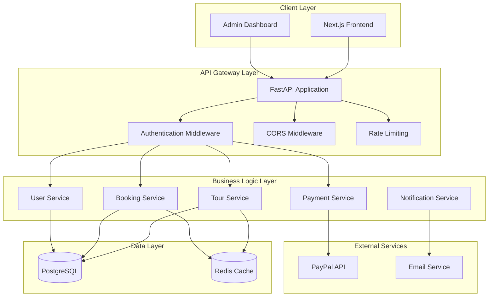
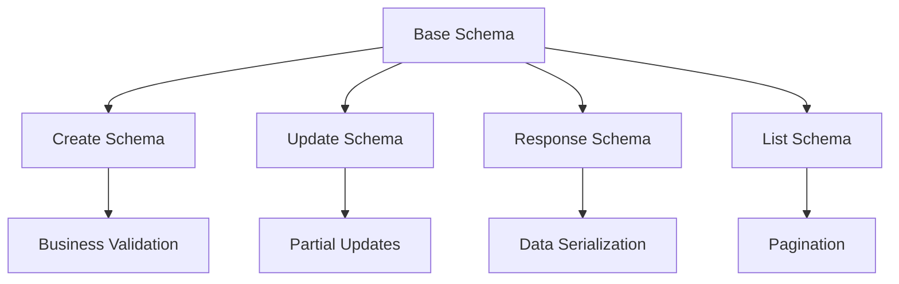
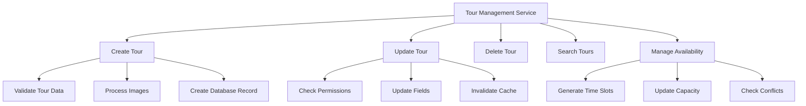
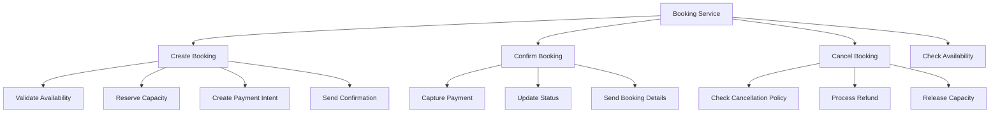
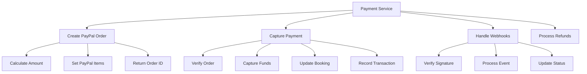
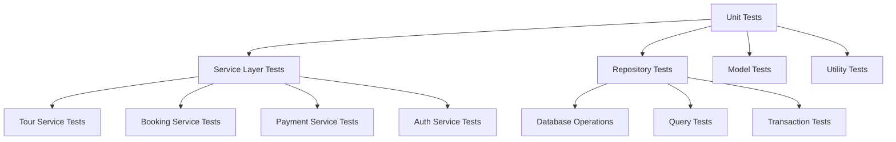
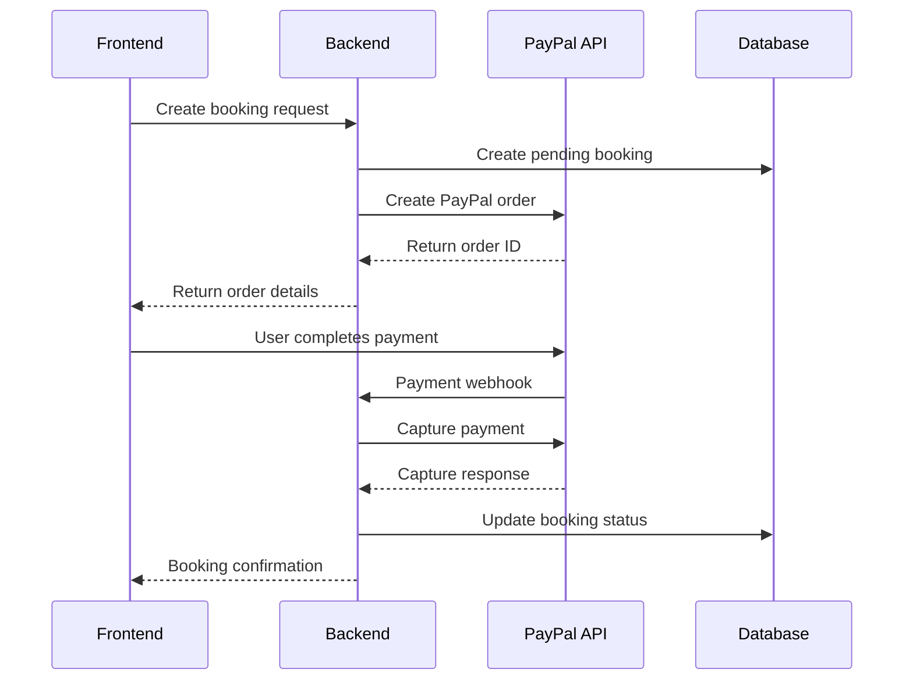
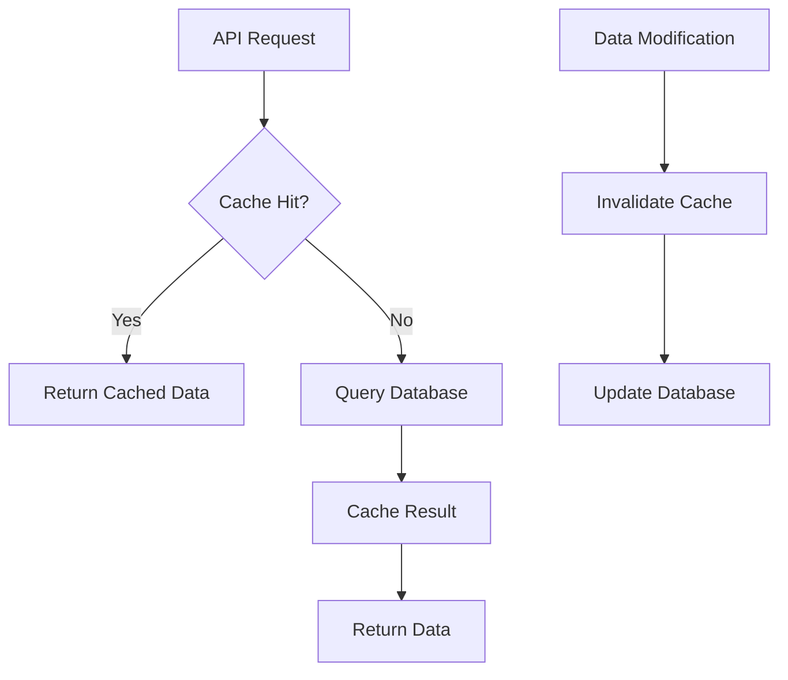
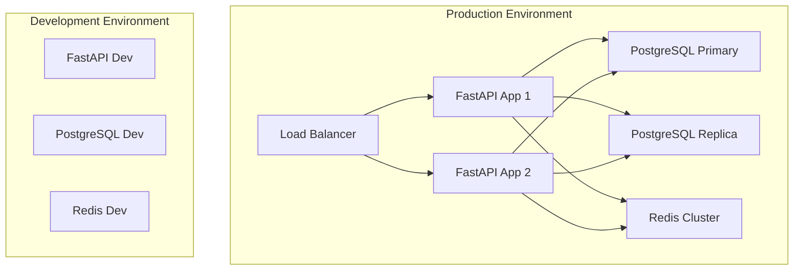

# Tours Backend Management System

## Overview

This document outlines the design for a comprehensive backend system to manage tours for the existing Next.js tour booking application. The backend will be built using **FastAPI**, **SQLAlchemy**, and **PostgreSQL**, following modern architectural patterns and best practices.

### Key Requirements
- **Tour Management**: Full CRUD operations for tours through admin interface
- **User Management**: Authentication and authorization system
- **Booking System**: Handle tour reservations and availability
- **Payment Integration**: PayPal payment processing integration
- **Admin Dashboard**: Administrative interface for tour management
- **Public API**: Endpoints for frontend consumption

### Technology Stack
- **API Framework**: FastAPI 0.104+
- **Data Validation**: Pydantic 2.0+ for request/response schemas
- **ORM**: SQLAlchemy 2.0+ with Alembic migrations
- **Database**: PostgreSQL 14+
- **Authentication**: JWT with refresh tokens
- **Payment**: PayPal REST API integration
- **Caching**: Redis for session management and caching
- **Documentation**: Automatic OpenAPI/Swagger generation
- **Task Queue**: Celery with Redis broker for background tasks
- **Testing**: pytest with async support

## Project File Structure

### Directory Organization

The project follows Clean Architecture principles with a clear separation of concerns and dependency flow:

```
tours-backend/
├── app/
│   ├── __init__.py
│   ├── main.py                    # FastAPI application entry point
│   ├── config.py                  # Configuration settings
│   ├── dependencies.py            # Global dependencies and DI
│   │
│   ├── api/                       # Presentation Layer
│   │   ├── __init__.py
│   │   ├── deps.py                # API dependencies
│   │   ├── errors/                # Error handlers
│   │   │   ├── __init__.py
│   │   │   ├── http_error.py
│   │   │   └── validation_error.py
│   │   └── v1/                    # API version 1
│   │       ├── __init__.py
│   │       ├── router.py          # Main API router
│   │       └── endpoints/         # API endpoints
│   │           ├── __init__.py
│   │           ├── auth.py        # Authentication endpoints
│   │           ├── tours.py       # Tour management endpoints
│   │           ├── bookings.py    # Booking endpoints
│   │           ├── payments.py    # Payment endpoints
│   │           ├── users.py       # User management endpoints
│   │           └── admin.py       # Admin-only endpoints
│   │
│   ├── core/                      # Application Core
│   │   ├── __init__.py
│   │   ├── security.py            # Security utilities (JWT, hashing)
│   │   ├── config.py              # Core configuration
│   │   ├── exceptions.py          # Custom exceptions
│   │   └── events.py              # Domain events
│   │
│   ├── schemas/                   # Pydantic Schemas (Interface Adapters)
│   │   ├── __init__.py
│   │   ├── common.py              # Common schemas and base classes
│   │   ├── auth.py                # Authentication schemas
│   │   ├── user.py                # User schemas
│   │   ├── tour.py                # Tour schemas
│   │   ├── booking.py             # Booking schemas
│   │   ├── payment.py             # Payment schemas
│   │   └── admin.py               # Admin-specific schemas
│   │
│   ├── models/                    # Domain Models (SQLAlchemy)
│   │   ├── __init__.py
│   │   ├── base.py                # Base model class
│   │   ├── user.py                # User entity
│   │   ├── tour.py                # Tour entity
│   │   ├── booking.py             # Booking entity
│   │   ├── payment.py             # Payment entity
│   │   └── availability.py        # Tour availability entity
│   │
│   ├── services/                  # Business Logic Layer (Use Cases)
│   │   ├── __init__.py
│   │   ├── base.py                # Base service class
│   │   ├── auth_service.py        # Authentication business logic
│   │   ├── user_service.py        # User management logic
│   │   ├── tour_service.py        # Tour management logic
│   │   ├── booking_service.py     # Booking business logic
│   │   ├── payment_service.py     # Payment processing logic
│   │   ├── notification_service.py # Notification logic
│   │   └── admin_service.py       # Admin operations
│   │
│   ├── repositories/              # Data Access Layer
│   │   ├── __init__.py
│   │   ├── base.py                # Base repository interface
│   │   ├── user_repository.py     # User data access
│   │   ├── tour_repository.py     # Tour data access
│   │   ├── booking_repository.py  # Booking data access
│   │   ├── payment_repository.py  # Payment data access
│   │   └── availability_repository.py # Availability data access
│   │
│   ├── infrastructure/            # Infrastructure Layer
│   │   ├── __init__.py
│   │   ├── database.py            # Database connection and session
│   │   ├── cache.py               # Redis cache implementation
│   │   ├── email/                 # Email service implementation
│   │   │   ├── __init__.py
│   │   │   ├── base.py
│   │   │   └── smtp_service.py
│   │   ├── payment/               # Payment service implementations
│   │   │   ├── __init__.py
│   │   │   ├── base.py
│   │   │   └── paypal_service.py
│   │   ├── storage/               # File storage implementations
│   │   │   ├── __init__.py
│   │   │   ├── base.py
│   │   │   ├── local_storage.py
│   │   │   └── s3_storage.py
│   │   └── tasks/                 # Background task implementations
│   │       ├── __init__.py
│   │       ├── celery_app.py
│   │       ├── email_tasks.py
│   │       └── payment_tasks.py
│   │
│   ├── middleware/                # Custom Middleware
│   │   ├── __init__.py
│   │   ├── auth_middleware.py     # Authentication middleware
│   │   ├── cors_middleware.py     # CORS configuration
│   │   ├── rate_limit_middleware.py # Rate limiting
│   │   └── logging_middleware.py  # Request/response logging
│   │
│   └── utils/                     # Utility Functions
│       ├── __init__.py
│       ├── date_utils.py          # Date/time utilities
│       ├── email_utils.py         # Email formatting utilities
│       ├── image_utils.py         # Image processing utilities
│       ├── validation_utils.py    # Custom validation functions
│       └── pagination_utils.py    # Pagination helpers
│
├── tests/                         # Test Suite
│   ├── __init__.py
│   ├── conftest.py                # Pytest configuration and fixtures
│   ├── unit/                      # Unit tests
│   │   ├── __init__.py
│   │   ├── test_services/         # Service layer tests
│   │   ├── test_repositories/     # Repository layer tests
│   │   ├── test_models/           # Model tests
│   │   └── test_utils/            # Utility function tests
│   ├── integration/               # Integration tests
│   │   ├── __init__.py
│   │   ├── test_api/              # API endpoint tests
│   │   ├── test_database/         # Database integration tests
│   │   └── test_external/         # External service tests
│   └── e2e/                       # End-to-end tests
│       ├── __init__.py
│       ├── test_booking_flow.py
│       ├── test_payment_flow.py
│       └── test_admin_flow.py
│
├── migrations/                    # Alembic database migrations
│   ├── versions/
│   ├── alembic.ini
│   ├── env.py
│   └── script.py.mako
│
├── scripts/                       # Utility scripts
│   ├── __init__.py
│   ├── create_admin.py           # Create admin user script
│   ├── seed_data.py              # Database seeding
│   ├── backup_db.py              # Database backup script
│   └── deploy.py                 # Deployment script
│
├── docker/                       # Docker configuration
│   ├── Dockerfile
│   ├── docker-compose.yml
│   ├── docker-compose.prod.yml
│   └── nginx.conf
│
├── docs/                         # Documentation
│   ├── api.md                    # API documentation
│   ├── deployment.md             # Deployment guide
│   ├── development.md            # Development setup
│   └── architecture.md           # Architecture overview
│
├── .env.example                  # Environment variables template
├── .gitignore
├── requirements.txt              # Python dependencies
├── requirements-dev.txt          # Development dependencies
├── pyproject.toml               # Project configuration
├── README.md
└── Makefile                     # Development commands
```

### Architecture Patterns Implementation

**Dependency Injection Pattern:**
- Services depend on repository interfaces, not implementations
- Repositories depend on database session interfaces
- External services use adapter pattern for easy testing and swapping

**Repository Pattern:**
- Abstracts data access logic from business logic
- Provides consistent interface for different data sources
- Enables easy testing with mock repositories

**Service Layer Pattern:**
- Encapsulates business logic and use cases
- Coordinates between repositories and external services
- Handles transaction management and business rules

**Schema Pattern with Pydantic:**
- Input validation and serialization
- Automatic API documentation generation
- Type safety and IDE support
- Custom validators for business rules

## Architecture

### System Architecture Overview



### Clean Architecture Implementation

The system follows Clean Architecture principles with clear separation of concerns:

- **Presentation Layer**: FastAPI routers and dependencies
- **Application Layer**: Use cases and business logic services
- **Domain Layer**: Entity models and business rules
- **Infrastructure Layer**: Database repositories and external service adapters

## API Endpoints Reference

### Authentication Endpoints

| Method | Endpoint | Description | Auth Required |
|--------|----------|-------------|---------------|
| POST | `/api/v1/auth/register` | User registration | No |
| POST | `/api/v1/auth/login` | User login | No |
| POST | `/api/v1/auth/refresh` | Refresh access token | Yes |
| POST | `/api/v1/auth/logout` | User logout | Yes |
| GET | `/api/v1/auth/me` | Get current user | Yes |

### Tour Management Endpoints

| Method | Endpoint | Description | Auth Required | Admin Only |
|--------|----------|-------------|---------------|------------|
| GET | `/api/v1/tours` | List all tours with filters | No | No |
| GET | `/api/v1/tours/{tour_id}` | Get tour details | No | No |
| POST | `/api/v1/tours` | Create new tour | Yes | Yes |
| PUT | `/api/v1/tours/{tour_id}` | Update tour | Yes | Yes |
| DELETE | `/api/v1/tours/{tour_id}` | Delete tour | Yes | Yes |
| GET | `/api/v1/tours/{tour_id}/availability` | Get tour availability | No | No |
| PUT | `/api/v1/tours/{tour_id}/availability` | Update availability | Yes | Yes |

### Booking Endpoints

| Method | Endpoint | Description | Auth Required |
|--------|----------|-------------|---------------|
| POST | `/api/v1/bookings` | Create booking | Yes |
| GET | `/api/v1/bookings` | List user bookings | Yes |
| GET | `/api/v1/bookings/{booking_id}` | Get booking details | Yes |
| PUT | `/api/v1/bookings/{booking_id}/cancel` | Cancel booking | Yes |
| GET | `/api/v1/admin/bookings` | List all bookings (admin) | Yes (Admin) |

### Payment Endpoints

| Method | Endpoint | Description | Auth Required |
|--------|----------|-------------|---------------|
| POST | `/api/v1/payments/create-order` | Create PayPal order | Yes |
| POST | `/api/v1/payments/capture-order` | Capture PayPal payment | Yes |
| GET | `/api/v1/payments/{payment_id}` | Get payment details | Yes |

## Data Models & ORM Mapping

### Core Entity Relationships

```mermaid
erDiagram
    User {
        uuid id PK
        string email UK
        string hashed_password
        string first_name
        string last_name
        enum role
        timestamp created_at
        timestamp updated_at
        bool is_active
    }
    
    Tour {
        uuid id PK
        string title
        string description
        text full_description
        decimal price
        decimal original_price
        string duration
        string location
        string city
        string meeting_point
        json highlights
        json included
        string cancellation_policy
        int max_group_size
        json gallery_images
        string main_image
        float rating
        int review_count
        bool is_active
        timestamp created_at
        timestamp updated_at
        uuid created_by FK
    }
    
    TourAvailability {
        uuid id PK
        uuid tour_id FK
        date available_date
        time available_time
        int max_capacity
        int booked_capacity
        decimal price_override
        bool is_available
        timestamp created_at
        timestamp updated_at
    }
    
    Booking {
        uuid id PK
        uuid user_id FK
        uuid tour_id FK
        uuid availability_id FK
        date booking_date
        time booking_time
        int guest_count
        decimal total_amount
        enum status
        string payment_intent_id
        json booking_details
        timestamp created_at
        timestamp updated_at
    }
    
    Payment {
        uuid id PK
        uuid booking_id FK
        string paypal_order_id
        string paypal_capture_id
        decimal amount
        enum status
        json paypal_response
        timestamp created_at
        timestamp updated_at
    }
    
    User ||--o{ Tour : creates
    User ||--o{ Booking : makes
    Tour ||--o{ TourAvailability : has
    Tour ||--o{ Booking : booked_for
    TourAvailability ||--o{ Booking : books
    Booking ||--|| Payment : has
```



### SQLAlchemy Model Implementation

```python
# Domain Models Structure
class UserRole(str, Enum):
    ADMIN = "admin"
    USER = "user"

class BookingStatus(str, Enum):
    PENDING = "pending"
    CONFIRMED = "confirmed"
    CANCELLED = "cancelled"
    COMPLETED = "completed"

class PaymentStatus(str, Enum):
    PENDING = "pending"
    COMPLETED = "completed"
    FAILED = "failed"
    REFUNDED = "refunded"
```

## Pydantic Schemas Architecture

### Schema Design Philosophy

Pydantic schemas serve as the interface between the API layer and business logic, providing:
- **Input Validation**: Automatic validation of request data
- **Output Serialization**: Consistent response formatting
- **Documentation**: Automatic OpenAPI schema generation
- **Type Safety**: Runtime type checking and IDE support

### Core Schema Patterns



### Schema Implementation Examples

**Base Schemas (schemas/common.py):**
```python
from pydantic import BaseModel, ConfigDict, Field
from datetime import datetime
from typing import Optional
from uuid import UUID

class BaseSchema(BaseModel):
    """Base schema with common configuration"""
    model_config = ConfigDict(
        from_attributes=True,
        validate_assignment=True,
        arbitrary_types_allowed=True,
        str_strip_whitespace=True
    )

class TimestampMixin(BaseModel):
    """Mixin for timestamp fields"""
    created_at: datetime
    updated_at: datetime

class PaginationParams(BaseModel):
    """Pagination parameters"""
    page: int = Field(default=1, ge=1, description="Page number")
    size: int = Field(default=20, ge=1, le=100, description="Items per page")

class PaginatedResponse(BaseModel, Generic[T]):
    """Generic paginated response"""
    items: List[T]
    total: int
    page: int
    size: int
    pages: int
```

**Tour Schemas (schemas/tour.py):**
```python
from pydantic import BaseModel, Field, validator, root_validator
from typing import List, Optional, Dict, Any
from decimal import Decimal
from datetime import date, time
from uuid import UUID

class TourBase(BaseSchema):
    """Base tour schema"""
    title: str = Field(..., min_length=3, max_length=200)
    description: str = Field(..., min_length=10, max_length=500)
    full_description: str = Field(..., min_length=50)
    location: str = Field(..., min_length=2, max_length=100)
    city: str = Field(..., min_length=2, max_length=100)
    meeting_point: str = Field(..., min_length=5, max_length=300)
    duration: str = Field(..., pattern=r'^\d+-\d+\s+(hours?|días?)$')
    max_group_size: int = Field(..., ge=1, le=50)
    cancellation_policy: str = Field(..., min_length=10)
    
    @validator('title')
    def validate_title(cls, v):
        if not v.strip():
            raise ValueError('Title cannot be empty')
        return v.title()
    
    @validator('location', 'city')
    def validate_location(cls, v):
        return v.upper()

class TourCreate(TourBase):
    """Schema for creating tours"""
    price: Decimal = Field(..., ge=0, decimal_places=2)
    original_price: Optional[Decimal] = Field(None, ge=0, decimal_places=2)
    highlights: List[str] = Field(..., min_items=1, max_items=10)
    included: List[str] = Field(..., min_items=1, max_items=15)
    
    @root_validator
    def validate_pricing(cls, values):
        price = values.get('price')
        original_price = values.get('original_price')
        
        if original_price and original_price <= price:
            raise ValueError('Original price must be higher than current price')
        
        return values

class TourUpdate(BaseSchema):
    """Schema for updating tours (partial updates)"""
    title: Optional[str] = Field(None, min_length=3, max_length=200)
    description: Optional[str] = Field(None, min_length=10, max_length=500)
    price: Optional[Decimal] = Field(None, ge=0, decimal_places=2)
    is_active: Optional[bool] = None
    highlights: Optional[List[str]] = Field(None, max_items=10)
    included: Optional[List[str]] = Field(None, max_items=15)

class TourResponse(TourBase, TimestampMixin):
    """Schema for tour responses"""
    id: UUID
    price: Decimal
    original_price: Optional[Decimal] = None
    highlights: List[str]
    included: List[str]
    main_image: Optional[str] = None
    gallery_images: List[str] = []
    rating: float = Field(ge=0, le=5)
    review_count: int = Field(ge=0)
    is_active: bool
    created_by: UUID
    
    @validator('gallery_images', pre=True)
    def validate_gallery(cls, v):
        if isinstance(v, str):
            return v.split(',') if v else []
        return v or []

class TourListResponse(BaseSchema):
    """Schema for tour list responses"""
    id: UUID
    title: str
    description: str
    location: str
    city: str
    price: Decimal
    original_price: Optional[Decimal] = None
    duration: str
    rating: float
    review_count: int
    main_image: Optional[str] = None
    is_active: bool

class TourSearchParams(BaseSchema):
    """Schema for tour search parameters"""
    q: Optional[str] = Field(None, description="Search query")
    location: Optional[str] = Field(None, description="Filter by location")
    city: Optional[str] = Field(None, description="Filter by city")
    min_price: Optional[Decimal] = Field(None, ge=0, description="Minimum price")
    max_price: Optional[Decimal] = Field(None, ge=0, description="Maximum price")
    min_duration: Optional[int] = Field(None, ge=1, description="Minimum duration in hours")
    max_duration: Optional[int] = Field(None, ge=1, description="Maximum duration in hours")
    min_rating: Optional[float] = Field(None, ge=0, le=5, description="Minimum rating")
    sort_by: Optional[str] = Field("created_at", regex="^(title|price|rating|created_at)$")
    sort_order: Optional[str] = Field("desc", regex="^(asc|desc)$")
```

**Booking Schemas (schemas/booking.py):**
```python
from pydantic import BaseModel, Field, validator, root_validator
from datetime import date, time, datetime
from decimal import Decimal
from uuid import UUID
from typing import Optional, Dict, Any

class BookingBase(BaseSchema):
    """Base booking schema"""
    tour_id: UUID
    booking_date: date = Field(..., description="Date of the tour")
    booking_time: time = Field(..., description="Time of the tour")
    guest_count: int = Field(..., ge=1, le=10, description="Number of guests")
    
    @validator('booking_date')
    def validate_future_date(cls, v):
        if v <= date.today():
            raise ValueError('Booking date must be in the future')
        return v

class BookingCreate(BookingBase):
    """Schema for creating bookings"""
    availability_id: UUID
    special_requests: Optional[str] = Field(None, max_length=500)
    contact_email: Optional[str] = Field(None, regex=r'^[^@]+@[^@]+\.[^@]+$')
    contact_phone: Optional[str] = Field(None, regex=r'^\+?[1-9]\d{1,14}$')

class BookingResponse(BookingBase, TimestampMixin):
    """Schema for booking responses"""
    id: UUID
    user_id: UUID
    status: BookingStatus
    total_amount: Decimal
    booking_reference: str
    payment_intent_id: Optional[str] = None
    tour: TourListResponse
    
    class Config:
        json_encoders = {
            Decimal: lambda v: float(v),
            UUID: lambda v: str(v)
        }

class BookingUpdate(BaseSchema):
    """Schema for updating bookings"""
    guest_count: Optional[int] = Field(None, ge=1, le=10)
    special_requests: Optional[str] = Field(None, max_length=500)
    contact_email: Optional[str] = Field(None, regex=r'^[^@]+@[^@]+\.[^@]+$')
    contact_phone: Optional[str] = Field(None, regex=r'^\+?[1-9]\d{1,14}$')

class BookingSearchParams(PaginationParams):
    """Schema for booking search parameters"""
    status: Optional[BookingStatus] = None
    tour_id: Optional[UUID] = None
    date_from: Optional[date] = None
    date_to: Optional[date] = None
    
    @root_validator
    def validate_date_range(cls, values):
        date_from = values.get('date_from')
        date_to = values.get('date_to')
        
        if date_from and date_to and date_from > date_to:
            raise ValueError('date_from must be before date_to')
        
        return values
```

**Authentication Schemas (schemas/auth.py):**
```python
from pydantic import BaseModel, Field, validator, EmailStr
from typing import Optional

class UserLogin(BaseSchema):
    """Schema for user login"""
    email: EmailStr
    password: str = Field(..., min_length=8)

class UserRegister(BaseSchema):
    """Schema for user registration"""
    email: EmailStr
    password: str = Field(..., min_length=8, max_length=128)
    confirm_password: str
    first_name: str = Field(..., min_length=2, max_length=50)
    last_name: str = Field(..., min_length=2, max_length=50)
    
    @validator('confirm_password')
    def passwords_match(cls, v, values, **kwargs):
        if 'password' in values and v != values['password']:
            raise ValueError('Passwords do not match')
        return v
    
    @validator('password')
    def validate_password_strength(cls, v):
        if not any(char.isdigit() for char in v):
            raise ValueError('Password must contain at least one digit')
        if not any(char.isupper() for char in v):
            raise ValueError('Password must contain at least one uppercase letter')
        return v

class TokenResponse(BaseSchema):
    """Schema for token responses"""
    access_token: str
    refresh_token: str
    token_type: str = "bearer"
    expires_in: int

class RefreshTokenRequest(BaseSchema):
    """Schema for token refresh"""
    refresh_token: str
```

**Payment Schemas (schemas/payment.py):**
```python
from pydantic import BaseModel, Field, validator
from decimal import Decimal
from uuid import UUID
from typing import Optional, Dict, Any
from datetime import datetime

class PaymentOrderCreate(BaseSchema):
    """Schema for creating PayPal orders"""
    booking_id: UUID
    return_url: Optional[str] = Field(None, regex=r'^https?://')
    cancel_url: Optional[str] = Field(None, regex=r'^https?://')

class PaymentOrderResponse(BaseSchema):
    """Schema for PayPal order responses"""
    order_id: str
    approval_url: str
    status: str

class PaymentCaptureRequest(BaseSchema):
    """Schema for capturing payments"""
    order_id: str
    
class PaymentCaptureResponse(BaseSchema):
    """Schema for payment capture responses"""
    capture_id: str
    status: str
    amount: Decimal
    currency: str = "EUR"
    
class PaymentResponse(BaseSchema, TimestampMixin):
    """Schema for payment responses"""
    id: UUID
    booking_id: UUID
    paypal_order_id: str
    paypal_capture_id: Optional[str] = None
    amount: Decimal
    status: PaymentStatus
    
class PaymentWebhookEvent(BaseSchema):
    """Schema for PayPal webhook events"""
    id: str
    event_type: str
    resource_type: str
    resource: Dict[str, Any]
    create_time: datetime
```

### Custom Validators and Business Rules

```python
# Custom validator examples (utils/validation_utils.py)
from pydantic import validator
from datetime import date, time, datetime
from typing import List

class BusinessValidators:
    """Collection of business-specific validators"""
    
    @staticmethod
    def validate_business_hours(booking_time: time) -> time:
        """Validate booking time is within business hours"""
        if booking_time < time(9, 0) or booking_time > time(18, 0):
            raise ValueError('Bookings only available between 9:00 and 18:00')
        return booking_time
    
    @staticmethod
    def validate_advance_booking(booking_date: date) -> date:
        """Validate booking is made with sufficient advance notice"""
        min_advance_days = 1
        min_date = date.today() + timedelta(days=min_advance_days)
        
        if booking_date < min_date:
            raise ValueError(f'Bookings must be made at least {min_advance_days} day(s) in advance')
        return booking_date
    
    @staticmethod
    def validate_tour_capacity(guest_count: int, max_capacity: int) -> int:
        """Validate guest count doesn't exceed tour capacity"""
        if guest_count > max_capacity:
            raise ValueError(f'Guest count ({guest_count}) exceeds maximum capacity ({max_capacity})')
        return guest_count
```

## Implementation Examples

### Dependency Injection Configuration

**Main Application Setup (app/main.py):**
```python
from fastapi import FastAPI, Depends
from fastapi.middleware.cors import CORSMiddleware
from app.api.v1.router import api_router
from app.core.config import settings
from app.infrastructure.database import engine
from app.models import Base
from app.middleware.auth_middleware import AuthMiddleware
from app.middleware.rate_limit_middleware import RateLimitMiddleware

# Create database tables
Base.metadata.create_all(bind=engine)

app = FastAPI(
    title="Tours Backend API",
    description="Backend API for tour management system",
    version="1.0.0",
    docs_url="/api/docs",
    redoc_url="/api/redoc",
    openapi_url="/api/openapi.json"
)

# Middleware configuration
app.add_middleware(
    CORSMiddleware,
    allow_origins=settings.ALLOWED_HOSTS,
    allow_credentials=True,
    allow_methods=["*"],
    allow_headers=["*"],
)

app.add_middleware(RateLimitMiddleware)
app.add_middleware(AuthMiddleware)

# Include API router
app.include_router(api_router, prefix="/api/v1")

@app.get("/health")
async def health_check():
    return {"status": "healthy", "timestamp": datetime.utcnow()}
```

**Dependency Injection Setup (app/dependencies.py):**
```python
from fastapi import Depends, HTTPException, status
from fastapi.security import HTTPBearer, HTTPAuthorizationCredentials
from sqlalchemy.ext.asyncio import AsyncSession
from app.infrastructure.database import get_db_session
from app.infrastructure.cache import get_redis_client
from app.repositories.user_repository import UserRepository
from app.repositories.tour_repository import TourRepository
from app.repositories.booking_repository import BookingRepository
from app.services.auth_service import AuthService
from app.services.tour_service import TourService
from app.services.booking_service import BookingService
from app.core.security import verify_token
from app.models.user import User
from typing import Optional

security = HTTPBearer()

# Repository Dependencies
def get_user_repository(db: AsyncSession = Depends(get_db_session)) -> UserRepository:
    return UserRepository(db)

def get_tour_repository(db: AsyncSession = Depends(get_db_session)) -> TourRepository:
    return TourRepository(db)

def get_booking_repository(db: AsyncSession = Depends(get_db_session)) -> BookingRepository:
    return BookingRepository(db)

# Service Dependencies
def get_auth_service(
    user_repo: UserRepository = Depends(get_user_repository),
    redis_client = Depends(get_redis_client)
) -> AuthService:
    return AuthService(user_repo, redis_client)

def get_tour_service(
    tour_repo: TourRepository = Depends(get_tour_repository),
    redis_client = Depends(get_redis_client)
) -> TourService:
    return TourService(tour_repo, redis_client)

def get_booking_service(
    booking_repo: BookingRepository = Depends(get_booking_repository),
    tour_repo: TourRepository = Depends(get_tour_repository)
) -> BookingService:
    return BookingService(booking_repo, tour_repo)

# Authentication Dependencies
async def get_current_user(
    credentials: HTTPAuthorizationCredentials = Depends(security),
    auth_service: AuthService = Depends(get_auth_service)
) -> User:
    """Get current authenticated user"""
    try:
        token = credentials.credentials
        user = await auth_service.verify_token(token)
        if not user:
            raise HTTPException(
                status_code=status.HTTP_401_UNAUTHORIZED,
                detail="Invalid authentication credentials"
            )
        return user
    except Exception:
        raise HTTPException(
            status_code=status.HTTP_401_UNAUTHORIZED,
            detail="Invalid authentication credentials"
        )

async def get_current_admin_user(
    current_user: User = Depends(get_current_user)
) -> User:
    """Get current admin user"""
    if current_user.role != UserRole.ADMIN:
        raise HTTPException(
            status_code=status.HTTP_403_FORBIDDEN,
            detail="Admin access required"
        )
    return current_user

def get_optional_current_user(
    credentials: Optional[HTTPAuthorizationCredentials] = Depends(security)
) -> Optional[User]:
    """Get current user if authenticated, None otherwise"""
    if not credentials:
        return None
    
    try:
        return get_current_user(credentials)
    except:
        return None
```

### Service Layer Implementation

**Base Service (services/base.py):**
```python
from abc import ABC, abstractmethod
from typing import TypeVar, Generic, List, Optional
from uuid import UUID
from sqlalchemy.ext.asyncio import AsyncSession
from app.repositories.base import BaseRepository

T = TypeVar('T')
CreateSchema = TypeVar('CreateSchema')
UpdateSchema = TypeVar('UpdateSchema')

class BaseService(Generic[T, CreateSchema, UpdateSchema], ABC):
    """Base service class with common CRUD operations"""
    
    def __init__(self, repository: BaseRepository[T]):
        self.repository = repository
    
    async def get_by_id(self, id: UUID) -> Optional[T]:
        """Get entity by ID"""
        return await self.repository.get_by_id(id)
    
    async def get_all(
        self, 
        skip: int = 0, 
        limit: int = 100,
        **filters
    ) -> List[T]:
        """Get all entities with optional filters"""
        return await self.repository.get_all(skip=skip, limit=limit, **filters)
    
    async def create(self, schema: CreateSchema) -> T:
        """Create new entity"""
        entity_data = schema.dict(exclude_unset=True)
        return await self.repository.create(entity_data)
    
    async def update(self, id: UUID, schema: UpdateSchema) -> Optional[T]:
        """Update existing entity"""
        update_data = schema.dict(exclude_unset=True, exclude_none=True)
        if not update_data:
            return await self.get_by_id(id)
        
        return await self.repository.update(id, update_data)
    
    async def delete(self, id: UUID) -> bool:
        """Delete entity by ID"""
        return await self.repository.delete(id)
    
    @abstractmethod
    async def validate_business_rules(self, schema: CreateSchema | UpdateSchema) -> None:
        """Validate business rules specific to this entity"""
        pass
```

**Tour Service Implementation (services/tour_service.py):**
```python
from typing import List, Optional, Dict, Any
from uuid import UUID
from decimal import Decimal
from app.services.base import BaseService
from app.repositories.tour_repository import TourRepository
from app.schemas.tour import TourCreate, TourUpdate, TourResponse, TourSearchParams
from app.models.tour import Tour
from app.core.exceptions import ValidationError, NotFoundError
from app.infrastructure.cache import CacheService
from app.utils.image_utils import process_tour_images

class TourService(BaseService[Tour, TourCreate, TourUpdate]):
    """Tour management business logic"""
    
    def __init__(self, repository: TourRepository, cache_service: CacheService):
        super().__init__(repository)
        self.cache_service = cache_service
    
    async def create_tour(
        self, 
        tour_data: TourCreate, 
        creator_id: UUID,
        images: Optional[List[Any]] = None
    ) -> TourResponse:
        """Create a new tour with image processing"""
        # Validate business rules
        await self.validate_business_rules(tour_data)
        
        # Process uploaded images
        processed_images = []
        main_image = None
        
        if images:
            processed_images = await process_tour_images(images)
            main_image = processed_images[0] if processed_images else None
        
        # Create tour data
        tour_dict = tour_data.dict()
        tour_dict.update({
            'created_by': creator_id,
            'main_image': main_image,
            'gallery_images': processed_images,
            'is_active': True,
            'rating': 0.0,
            'review_count': 0
        })
        
        tour = await self.repository.create(tour_dict)
        
        # Generate initial availability
        await self._generate_initial_availability(tour.id)
        
        # Cache the new tour
        await self.cache_service.set(
            f"tour:{tour.id}", 
            tour, 
            expire=3600
        )
        
        return TourResponse.from_orm(tour)
    
    async def search_tours(
        self, 
        search_params: TourSearchParams,
        skip: int = 0,
        limit: int = 20
    ) -> Dict[str, Any]:
        """Search tours with caching"""
        cache_key = f"tours:search:{hash(str(search_params.dict()))}:{skip}:{limit}"
        
        # Try to get from cache first
        cached_result = await self.cache_service.get(cache_key)
        if cached_result:
            return cached_result
        
        # Search in database
        tours, total = await self.repository.search_tours(
            search_params=search_params,
            skip=skip,
            limit=limit
        )
        
        result = {
            'tours': [TourResponse.from_orm(tour) for tour in tours],
            'total': total,
            'page': (skip // limit) + 1,
            'pages': (total + limit - 1) // limit
        }
        
        # Cache the result
        await self.cache_service.set(cache_key, result, expire=300)
        
        return result
    
    async def update_tour(
        self, 
        tour_id: UUID, 
        tour_data: TourUpdate,
        images: Optional[List[Any]] = None
    ) -> TourResponse:
        """Update tour with image processing"""
        existing_tour = await self.get_by_id(tour_id)
        if not existing_tour:
            raise NotFoundError("Tour not found")
        
        # Validate business rules
        await self.validate_business_rules(tour_data)
        
        update_dict = tour_data.dict(exclude_unset=True, exclude_none=True)
        
        # Process new images if provided
        if images:
            processed_images = await process_tour_images(images)
            update_dict['gallery_images'] = processed_images
            if processed_images:
                update_dict['main_image'] = processed_images[0]
        
        updated_tour = await self.repository.update(tour_id, update_dict)
        
        # Invalidate caches
        await self.cache_service.delete(f"tour:{tour_id}")
        await self.cache_service.delete_pattern("tours:search:*")
        
        return TourResponse.from_orm(updated_tour)
    
    async def get_tour_availability(
        self, 
        tour_id: UUID, 
        date_from: Optional[date] = None,
        date_to: Optional[date] = None
    ) -> List[Dict[str, Any]]:
        """Get tour availability for date range"""
        return await self.repository.get_availability(
            tour_id=tour_id,
            date_from=date_from,
            date_to=date_to
        )
    
    async def validate_business_rules(self, tour_data: TourCreate | TourUpdate) -> None:
        """Validate tour business rules"""
        if hasattr(tour_data, 'title'):
            # Check for duplicate titles
            existing = await self.repository.get_by_title(tour_data.title)
            if existing:
                raise ValidationError("Tour with this title already exists")
        
        if hasattr(tour_data, 'price') and hasattr(tour_data, 'original_price'):
            if tour_data.original_price and tour_data.original_price <= tour_data.price:
                raise ValidationError("Original price must be higher than current price")
    
    async def _generate_initial_availability(self, tour_id: UUID) -> None:
        """Generate initial availability slots for the tour"""
        # Implementation for generating default availability
        # This would create availability records for the next 30 days
        pass
```

### Repository Pattern Implementation

**Base Repository (repositories/base.py):**
```python
from abc import ABC, abstractmethod
from typing import TypeVar, Generic, List, Optional, Dict, Any
from uuid import UUID
from sqlalchemy import select, update, delete, func
from sqlalchemy.ext.asyncio import AsyncSession
from sqlalchemy.orm import selectinload

T = TypeVar('T')

class BaseRepository(Generic[T], ABC):
    """Base repository with common database operations"""
    
    def __init__(self, db: AsyncSession, model_class: type[T]):
        self.db = db
        self.model_class = model_class
    
    async def get_by_id(self, id: UUID) -> Optional[T]:
        """Get entity by ID"""
        result = await self.db.execute(
            select(self.model_class).where(self.model_class.id == id)
        )
        return result.scalar_one_or_none()
    
    async def get_all(
        self, 
        skip: int = 0, 
        limit: int = 100,
        **filters
    ) -> List[T]:
        """Get all entities with optional filters"""
        query = select(self.model_class)
        
        # Apply filters
        for key, value in filters.items():
            if hasattr(self.model_class, key) and value is not None:
                query = query.where(getattr(self.model_class, key) == value)
        
        query = query.offset(skip).limit(limit)
        result = await self.db.execute(query)
        return result.scalars().all()
    
    async def create(self, entity_data: Dict[str, Any]) -> T:
        """Create new entity"""
        entity = self.model_class(**entity_data)
        self.db.add(entity)
        await self.db.commit()
        await self.db.refresh(entity)
        return entity
    
    async def update(self, id: UUID, update_data: Dict[str, Any]) -> Optional[T]:
        """Update existing entity"""
        await self.db.execute(
            update(self.model_class)
            .where(self.model_class.id == id)
            .values(**update_data)
        )
        await self.db.commit()
        return await self.get_by_id(id)
    
    async def delete(self, id: UUID) -> bool:
        """Delete entity by ID"""
        result = await self.db.execute(
            delete(self.model_class).where(self.model_class.id == id)
        )
        await self.db.commit()
        return result.rowcount > 0
    
    async def count(self, **filters) -> int:
        """Count entities with optional filters"""
        query = select(func.count(self.model_class.id))
        
        for key, value in filters.items():
            if hasattr(self.model_class, key) and value is not None:
                query = query.where(getattr(self.model_class, key) == value)
        
        result = await self.db.execute(query)
        return result.scalar()
```

**Tour Repository Implementation (repositories/tour_repository.py):**
```python
from typing import List, Optional, Tuple, Dict, Any
from uuid import UUID
from datetime import date
from sqlalchemy import select, and_, or_, func, text
from sqlalchemy.orm import selectinload, joinedload
from app.repositories.base import BaseRepository
from app.models.tour import Tour
from app.models.availability import TourAvailability
from app.schemas.tour import TourSearchParams

class TourRepository(BaseRepository[Tour]):
    """Tour-specific database operations"""
    
    def __init__(self, db: AsyncSession):
        super().__init__(db, Tour)
    
    async def get_by_title(self, title: str) -> Optional[Tour]:
        """Get tour by title"""
        result = await self.db.execute(
            select(Tour).where(Tour.title == title)
        )
        return result.scalar_one_or_none()
    
    async def search_tours(
        self,
        search_params: TourSearchParams,
        skip: int = 0,
        limit: int = 20
    ) -> Tuple[List[Tour], int]:
        """Search tours with complex filtering"""
        query = select(Tour).where(Tour.is_active == True)
        count_query = select(func.count(Tour.id)).where(Tour.is_active == True)
        
        # Apply search filters
        if search_params.q:
            search_term = f"%{search_params.q}%"
            search_condition = or_(
                Tour.title.ilike(search_term),
                Tour.description.ilike(search_term),
                Tour.location.ilike(search_term),
                Tour.city.ilike(search_term)
            )
            query = query.where(search_condition)
            count_query = count_query.where(search_condition)
        
        if search_params.location:
            query = query.where(Tour.location == search_params.location.upper())
            count_query = count_query.where(Tour.location == search_params.location.upper())
        
        if search_params.city:
            query = query.where(Tour.city == search_params.city.upper())
            count_query = count_query.where(Tour.city == search_params.city.upper())
        
        if search_params.min_price:
            query = query.where(Tour.price >= search_params.min_price)
            count_query = count_query.where(Tour.price >= search_params.min_price)
        
        if search_params.max_price:
            query = query.where(Tour.price <= search_params.max_price)
            count_query = count_query.where(Tour.price <= search_params.max_price)
        
        if search_params.min_rating:
            query = query.where(Tour.rating >= search_params.min_rating)
            count_query = count_query.where(Tour.rating >= search_params.min_rating)
        
        # Apply sorting
        sort_column = getattr(Tour, search_params.sort_by, Tour.created_at)
        if search_params.sort_order == "asc":
            query = query.order_by(sort_column.asc())
        else:
            query = query.order_by(sort_column.desc())
        
        # Apply pagination
        query = query.offset(skip).limit(limit)
        
        # Execute queries
        tours_result = await self.db.execute(query)
        total_result = await self.db.execute(count_query)
        
        tours = tours_result.scalars().all()
        total = total_result.scalar()
        
        return tours, total
    
    async def get_availability(
        self,
        tour_id: UUID,
        date_from: Optional[date] = None,
        date_to: Optional[date] = None
    ) -> List[Dict[str, Any]]:
        """Get tour availability for date range"""
        query = (
            select(TourAvailability)
            .where(TourAvailability.tour_id == tour_id)
            .where(TourAvailability.is_available == True)
        )
        
        if date_from:
            query = query.where(TourAvailability.available_date >= date_from)
        
        if date_to:
            query = query.where(TourAvailability.available_date <= date_to)
        
        query = query.order_by(
            TourAvailability.available_date.asc(),
            TourAvailability.available_time.asc()
        )
        
        result = await self.db.execute(query)
        availability_records = result.scalars().all()
        
        return [
            {
                'id': record.id,
                'date': record.available_date,
                'time': record.available_time,
                'available_capacity': record.max_capacity - record.booked_capacity,
                'max_capacity': record.max_capacity,
                'price': record.price_override or record.tour.price
            }
            for record in availability_records
        ]
```

This comprehensive file structure and implementation follows clean architecture principles with proper separation of concerns, dependency injection, and maintains consistency with the established patterns throughout the system.

### Tour Management Service



#### Core Operations

**Tour Creation Process:**
1. Validate input data using Pydantic schemas
2. Process and store tour images
3. Create tour record with default availability
4. Generate initial time slots
5. Cache tour data for quick access

**Availability Management:**
1. Generate availability slots based on tour schedule
2. Track booking capacity per time slot
3. Handle dynamic pricing for peak times
4. Manage blackout dates and special schedules

### Booking Management Service



#### Booking Workflow

**Reservation Process:**
1. Check tour availability for requested date/time
2. Validate guest count against capacity
3. Calculate total price including any discounts
4. Create pending booking record
5. Initialize PayPal payment order
6. Reserve capacity temporarily (15-minute timeout)

**Confirmation Process:**
1. Capture PayPal payment
2. Update booking status to confirmed
3. Release temporary reservation
4. Update availability capacity
5. Send confirmation email to user
6. Generate booking reference number

### Payment Integration Service



### User Management Service

**Authentication & Authorization:**
- JWT-based authentication with refresh tokens
- Role-based access control (RBAC)
- Password hashing using bcrypt
- Session management with Redis

**User Operations:**
- User registration with email verification
- Password reset functionality
- Profile management
- Admin user management

## Middleware & Interceptors

### Authentication Middleware

```python
# Authentication Flow
async def verify_token(token: str) -> User:
    """Verify JWT token and return user"""
    try:
        payload = jwt.decode(token, SECRET_KEY, algorithms=[ALGORITHM])
        user_id = payload.get("sub")
        if not user_id:
            raise HTTPException(status_code=401)
        
        # Check if token is blacklisted
        if await is_token_blacklisted(token):
            raise HTTPException(status_code=401)
            
        user = await get_user_by_id(user_id)
        if not user or not user.is_active:
            raise HTTPException(status_code=401)
            
        return user
    except JWTError:
        raise HTTPException(status_code=401)
```

### CORS Configuration

```python
# CORS Settings for Frontend Integration
app.add_middleware(
    CORSMiddleware,
    allow_origins=["http://localhost:3000", "https://yourdomain.com"],
    allow_credentials=True,
    allow_methods=["*"],
    allow_headers=["*"],
)
```

### Rate Limiting

```python
# Rate limiting implementation
@app.middleware("http")
async def rate_limit_middleware(request: Request, call_next):
    """Rate limiting based on IP and user"""
    client_ip = request.client.host
    
    # Different limits for different endpoints
    if request.url.path.startswith("/api/v1/auth"):
        limit = "5/minute"  # Stricter for auth endpoints
    else:
        limit = "100/minute"  # General API limit
    
    # Implement rate limiting logic
    await check_rate_limit(client_ip, limit)
    
    response = await call_next(request)
    return response
```

## Testing Strategy

### Unit Testing Structure



### Test Categories

**Service Layer Tests:**
- Test business logic in isolation
- Mock external dependencies
- Validate input/output transformations
- Test error handling scenarios

**Integration Tests:**
- Database integration tests
- API endpoint tests
- PayPal integration tests
- Email service tests

**E2E Tests:**
- Complete booking workflow
- Payment processing flow
- Admin tour management
- User authentication flow

### Test Implementation Examples

```python
# Example test structure
class TestTourService:
    async def test_create_tour_success(self):
        """Test successful tour creation"""
        
    async def test_create_tour_duplicate_title(self):
        """Test tour creation with duplicate title"""
        
    async def test_update_tour_not_found(self):
        """Test updating non-existent tour"""

class TestBookingService:
    async def test_create_booking_success(self):
        """Test successful booking creation"""
        
    async def test_create_booking_no_availability(self):
        """Test booking when no availability"""
        
    async def test_cancel_booking_within_policy(self):
        """Test booking cancellation within policy"""
```

## PayPal Integration Architecture

### Payment Flow Design



### PayPal Service Implementation

**Order Creation:**
- Create PayPal order with booking details
- Set appropriate return URLs
- Include custom metadata for tracking
- Handle currency conversion if needed

**Payment Capture:**
- Verify order authenticity
- Capture payment funds
- Handle capture failures gracefully
- Update booking status atomically

**Webhook Processing:**
- Verify PayPal webhook signatures
- Process payment events asynchronously
- Handle duplicate events idempotently
- Log all webhook events for audit

### Integration Decision: Frontend vs Backend

**Recommendation: Hybrid Approach**

1. **Frontend (Next.js) Handles:**
   - PayPal button rendering
   - User payment interaction
   - Payment success/failure UI feedback

2. **Backend (FastAPI) Handles:**
   - Order creation and validation
   - Payment capture and verification
   - Booking confirmation
   - Webhook processing
   - Security and fraud detection

This approach provides optimal user experience while maintaining security and data integrity.

## Security Considerations

### Authentication Security

```python
# Security best practices implementation
class SecurityConfig:
    # JWT Configuration
    ACCESS_TOKEN_EXPIRE_MINUTES = 30
    REFRESH_TOKEN_EXPIRE_DAYS = 7
    ALGORITHM = "HS256"
    
    # Password Security
    BCRYPT_ROUNDS = 12
    MIN_PASSWORD_LENGTH = 8
    
    # Rate Limiting
    LOGIN_ATTEMPTS_LIMIT = 5
    LOGIN_LOCKOUT_DURATION = 900  # 15 minutes
```

### Data Protection Measures

**Input Validation:**
- Comprehensive Pydantic schema validation
- SQL injection prevention through ORM
- XSS protection with proper encoding
- File upload validation and sanitization

**API Security:**
- HTTPS enforcement
- CORS configuration
- Rate limiting per endpoint
- Request size limits
- API versioning for backward compatibility

**Database Security:**
- Connection encryption
- Prepared statements via SQLAlchemy
- Regular backup procedures
- Access control and permissions

## Caching Strategy

### Redis Implementation



### Caching Patterns

**Cache-Aside Pattern:**
- Tours list with filters
- Tour availability data
- User session data
- Search results

**Write-Through Pattern:**
- User preferences
- Booking confirmations
- Payment status updates

**Cache Invalidation:**
- Time-based expiration for tour data
- Event-based invalidation for bookings
- Manual cache warming for popular tours
- Distributed cache invalidation for multi-instance deployment

## Deployment Architecture

### Container Strategy



### Environment Configuration

**Production Setup:**
- Multi-instance FastAPI deployment
- PostgreSQL with read replicas
- Redis cluster for high availability
- SSL/TLS encryption
- Monitoring and logging

**Development Setup:**
- Single FastAPI instance
- Local PostgreSQL instance
- Local Redis instance
- Debug mode enabled
- Hot reload for development

## Performance Optimization

### Database Optimization

**Query Optimization:**
- Strategic indexing on frequently queried fields
- Connection pooling configuration
- Query caching for expensive operations
- Pagination for large result sets

**Specific Indexes:**
```sql
-- Tour search optimization
CREATE INDEX idx_tours_location_city ON tours(location, city);
CREATE INDEX idx_tours_price_rating ON tours(price, rating);
CREATE INDEX idx_tours_created_at ON tours(created_at DESC);

-- Availability optimization
CREATE INDEX idx_availability_tour_date ON tour_availability(tour_id, available_date);
CREATE INDEX idx_availability_date_time ON tour_availability(available_date, available_time);

-- Booking optimization
CREATE INDEX idx_bookings_user_status ON bookings(user_id, status);
CREATE INDEX idx_bookings_date_status ON bookings(booking_date, status);
```

### API Performance

**Response Optimization:**
- Selective field loading with Pydantic
- Async database operations
- Connection pooling
- Response compression
- CDN integration for static assets

**Background Tasks:**
- Email notifications
- Payment webhook processing
- Cache warming
- Analytics data collection

## Monitoring & Observability

### Logging Strategy

```python
# Structured logging implementation
import structlog

logger = structlog.get_logger()

# Example usage in service
async def create_booking(booking_data: BookingCreate):
    logger.info(
        "booking_creation_started",
        user_id=booking_data.user_id,
        tour_id=booking_data.tour_id,
        guest_count=booking_data.guest_count
    )
    
    try:
        booking = await booking_service.create(booking_data)
        logger.info(
            "booking_creation_completed",
            booking_id=booking.id,
            status=booking.status
        )
        return booking
    except Exception as e:
        logger.error(
            "booking_creation_failed",
            error=str(e),
            user_id=booking_data.user_id
        )
        raise
```

### Metrics Collection

**Business Metrics:**
- Booking conversion rates
- Popular tour analysis
- Revenue tracking
- User engagement metrics

**Technical Metrics:**
- API response times
- Database query performance
- Cache hit rates
- Error rates and types

**Health Checks:**
- Database connectivity
- Redis availability
- PayPal API status
- External service dependencies

### Alert Configuration

**Critical Alerts:**
- Database connection failures
- Payment processing errors
- High error rates (>5%)
- Response time degradation (>2s)

**Warning Alerts:**
- Cache miss rate increase
- Disk space utilization
- Memory usage thresholds
- Failed background tasks